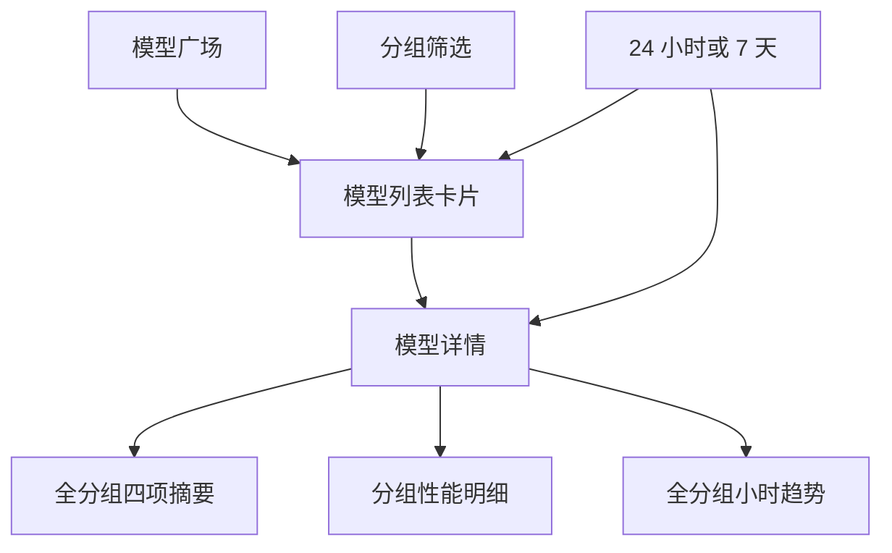
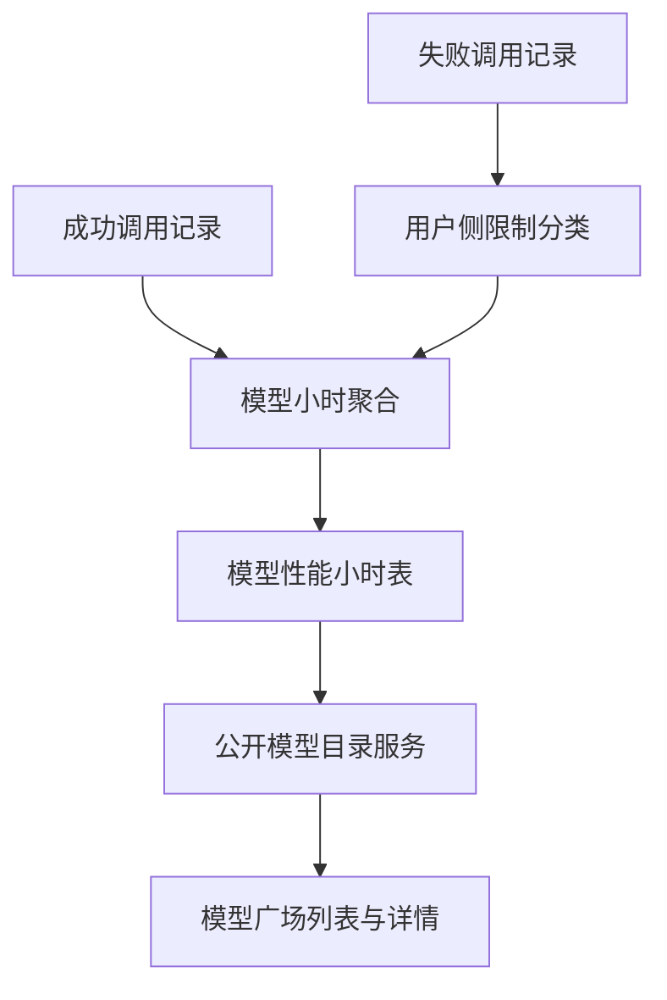
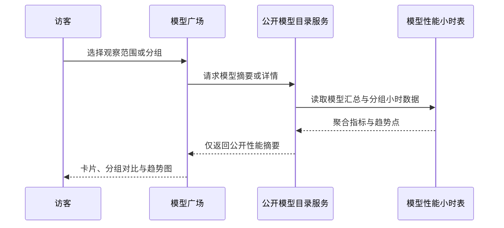

# Model Performance Metrics - Plan

## Goal Capsule

- **目标：** 让访问模型广场的用户能够基于真实调用表现比较模型及其不同分组。
- **产品权限：** 本文档定义模型广场性能信息的公开展示范围与统计口径；后续实现计划可决定具体的数据存储、接口和组件设计。
- **开放阻塞项：** 无。
- **执行画像：** 先建立可回填的小时聚合与统一错误分类，再扩展公开查询和模型广场；以契约、聚合和页面测试共同证明行为。
- **停止条件：** 所有产品需求、条件验收示例和下文定义的验证门槛均通过，且公共响应未泄露用户、API Key 或账号维度数据。
- **后续归属：** 上线后由既有 Ops 聚合与清理任务维护数据新鲜度和保留期。

---

## Product Contract

### Summary

在公开模型广场增加以小时为窗口的模型性能数据。
模型列表提供可比较的性能摘要，模型详情提供全分组汇总、分组明细和全分组小时趋势，并支持最近 24 小时与最近 7 天切换。

### Problem Frame

用户目前无法从模型广场判断同一模型在不同分组中的实际表现。
仅有价格和能力信息不足以帮助用户在延迟、生成速度和稳定性之间作出选择。

### Key Decisions

- **公开性能信息：** 所有能够访问模型广场的访客均可查看性能数据，无需登录。(session-settled: user-directed — chosen over authenticated or admin-only access: 模型比较需要公开。)
- **固定观察范围：** 性能数据只支持最近 24 小时和最近 7 天切换。(session-settled: user-directed — chosen over a single fixed period: 用户需要在短期与周度表现之间切换。)
- **模型服务可用率：** 可用率只统计可归因于模型服务的请求，业务限制与用户 API Key 失效导致的 `403` 不计入分子或分母。(session-settled: user-approved — chosen over counting every failed request: 用户侧限制不能被误判为模型不可用。)
- **TPS 含义：** TPS 使用成功请求的输出 token 总数除以这些请求的总响应时长，表示模型生成速度而非该小时的流量。(session-settled: user-approved — chosen over hourly traffic throughput: 需要比较模型输出速度。)
- **空样本呈现：** 没有有效样本的模型或分组以 `-` 呈现指标，避免把未知数据误读为零或不可用。

### Actors

- A1. 模型广场访客：比较模型和分组的价格、能力与实际性能后选择调用目标。
- A2. 性能指标服务：按模型、分组和小时窗口提供经过统一口径汇总的性能观测值。

### Requirements

**统计口径**

- R1. 系统必须以小时为基本统计窗口，为模型的全分组和单分组范围计算 TPS、可用率、平均首字时长和平均请求时长。
- R2. 所有性能展示必须支持最近 24 小时和最近 7 天，并在同一选定范围内保持列表、详情、分组明细和趋势图的口径一致。
- R3. 可用率必须以有效成功请求与有效失败请求计算，并排除业务限制及用户 API Key 失效导致的 `403`。
- R4. TPS 必须仅使用成功请求的输出 token 与请求总响应时长计算。
- R5. 平均首字时长只使用存在首字时长的有效成功请求，平均请求时长只使用有效成功请求。
- R6. 选定范围的汇总必须按每个小时的实际样本量合并，不得对各小时平均值做等权平均。

**模型列表**

- R7. 未选定分组时，每张模型卡片必须展示全分组汇总的延迟、吞吐和状态，其中延迟为平均首字时长，吞吐为 TPS，状态为可用率。
- R8. 选定分组筛选后，模型列表必须继续筛选到该分组支持的模型，并将每张卡片的延迟、吞吐和状态替换为该分组的对应指标。
- R9. 卡片没有有效样本时，相关性能指标必须显示 `-`。

**模型详情**

- R10. 模型详情必须展示选定范围内的全分组 TPS、可用率、平均首字时长和平均请求时长。
- R11. 模型详情必须仅按当前仍支持该模型的分组展示同一组四项性能指标，以便直接比较分组表现。
- R12. 模型详情必须展示全分组平均首字时长的小时折线图和全分组可用率的小时折线图，并随时间范围切换更新。
- R13. 模型详情中的没有有效样本的汇总或分组指标必须显示 `-`。

**公开访问**

- R14. 模型列表、详情、分组性能明细和小时趋势必须对模型广场的所有访客公开。

### Public Surface

### Key Flows

- F1. 默认比较
  - **触发：** 访客打开模型广场。
  - **步骤：** 页面使用当前时间范围加载模型卡片的全分组延迟、TPS 和可用率；访客打开某模型详情查看全分组摘要、分组明细和两张趋势图。
  - **结果：** 访客可先横向比较模型，再查看某个模型的分组差异。
- F2. 分组比较
  - **触发：** 访客在模型广场选择一个分组。
  - **步骤：** 列表保留该分组支持的模型，并为每张卡片加载该分组的性能指标。
  - **结果：** 卡片指标与所选分组一致，访客可比较该分组内模型的真实表现。
- F3. 时间范围切换
  - **触发：** 访客选择最近 24 小时或最近 7 天。
  - **步骤：** 页面按选定范围重新汇总小时数据并更新可见性能指标和趋势图。
  - **结果：** 访客可在短期波动和周度稳定性之间切换观察。

### Acceptance Examples

- AE1. **Covers R7, R10, R12.**
  - **Given：** 访客未选择分组且选择最近 24 小时。
  - **When：** 访客查看某模型卡片并打开详情。
  - **Then：** 卡片显示全分组延迟、TPS、可用率，详情显示同一范围的四项全分组指标和两张全分组小时趋势图。
- AE2. **Covers R8, R11.**
  - **Given：** 访客选择一个分组。
  - **When：** 访客查看模型列表。
  - **Then：** 列表只保留该分组支持的模型，且每张卡片的三项性能指标均来自该分组。
- AE3. **Covers R3.**
  - **Given：** 某小时同时存在成功请求、模型服务失败、业务限制失败和 API Key 失效 `403`。
  - **When：** 系统计算该模型的可用率。
  - **Then：** 只有成功请求和模型服务失败参与可用率计算。
- AE4. **Covers R9, R13.**
  - **Given：** 选定范围内某模型或分组没有有效样本。
  - **When：** 访客查看对应性能指标。
  - **Then：** 指标显示 `-`，而非 `0` 或不可用状态。
- AE5. **Covers R2, R6.**
  - **Given：** 最近 24 小时内各小时的请求量不同。
  - **When：** 访客切换最近 24 小时与最近 7 天。
  - **Then：** 每个范围的汇总按实际样本量合并，且列表和详情使用相同的选定范围。

### Success Criteria

- 在相同模型、分组范围和时间范围下，模型卡片与模型详情的对应性能值一致。
- 访客可在不登录的情况下完成模型与分组的性能比较。
- 没有样本的数据不会显示为零、成功或失败。

### Scope Boundaries

- 本期仅提供最近 24 小时和最近 7 天，不提供任意起止时间选择。
- 本期仅为全分组提供首字时长和可用率小时趋势图，不增加分组趋势图、TPS 趋势图或请求时长趋势图。
- 本期展示实际调用观测值，不引入第三方基准测试或主动健康探测结果。

### Dependencies / Assumptions

- 成功请求数据需要能按模型、分组、输出 token、总时长和首字时长归属。
- 失败请求数据需要能按模型、分组和失败类别识别，以正确排除用户侧业务限制与 API Key 失效 `403`。
- 模型广场继续作为模型目录与详情的公开入口，性能数据在该入口中与现有价格和能力信息并列呈现。

### Sources / Research

- `frontend/src/views/ModelPricingPage.vue`：现有公开模型列表卡片与模型详情分组表。
- `frontend/src/api/modelPricing.ts`：现有模型列表与详情的数据契约。
- `backend/internal/service/model_pricing_page.go`：现有模型目录和分组详情的聚合边界。
- `backend/internal/repository/ops_repo_preagg.go`：当前按小时汇总成功与失败运营指标的模式。
- `backend/internal/repository/ops_repo_openai_token_stats.go`：现有 TPS、平均首字时长和平均请求时长的统计口径。

---

## Planning Contract

### Product Contract Preservation

Product Contract unchanged.

### Key Technical Decisions

- **独立保存模型小时聚合：** 新增专用的模型性能小时表，不向现有全局 Ops 小时表增加模型维度。每个模型既保存跨分组汇总行，也保存按分组的行，查询不需要扫描原始请求日志。`(session-settled: user-directed — chosen over using only currently supported groups for the overall metric: 全分组汇总表示该模型跨所有分组的整体表现。)`
- **沿用 Ops 调度但维护独立水位：** 模型聚合复用现有的安全延迟、分布式锁、重算重叠和心跳机制，但拥有独立的最新小时水位；空表首次运行回填最近七个完整自然日，后续仅重算重叠窗口。
- **使用面向访客的模型标识：** 成功请求与失败请求都按现有调用链记录的客户端可见模型标识归并，不按上游映射后的内部名称拆分公开指标。
- **在记录错误时统一排除用户侧限制：** 将失效 API Key 归类为业务限制，使新模型可用率与既有 Ops SLA 使用同一个分母规则。`(session-settled: user-approved — chosen over counting every failed request: 用户侧限制不能被误判为模型不可用。)`
- **按目录批量附加性能：** 模型目录先决定哪些模型和分组公开，再批量读取对应范围的性能聚合；未选组使用模型汇总行，选组只使用该分组行，避免逐卡片查询。
- **强制七天可读保留：** 公开性能表接入现有小时指标清理流程，并在清理启用时至少保留七天，以兑现最长公开观察范围。
- **固定完整小时窗口：** `24h` 与 `7d` 分别表示截至安全延迟后最近的 24 或 168 个完整 UTC 小时，查询使用半开区间 `[start, end)`；小时点以 ISO 8601 UTC 返回，前端仅负责按访客时区格式化标签。这样列表、详情与趋势的边界可复现，且不会把尚未稳定的当前小时当作完整样本。

### High-Level Technical Design

### System-Wide Impact

- **数据生命周期：** 模型性能数据随现有 Ops 聚合任务刷新，并随小时指标保留策略清理；首次回填只覆盖产品承诺的最近七天。
- **运维语义：** 失效 API Key 会进入既有的用户侧限制分类，现有 Ops SLA 数值会同步修正，不再把这类失败视为服务不可用。
- **公开边界：** 公共接口只返回模型、分组、时间范围和聚合指标；不得返回用户、API Key、账号、请求内容或单次错误详情。
- **上线可用性：** 迁移完成但七天回填尚未完成时，公开接口继续返回现有目录数据与空性能值；不得以扫描原始日志作为公开查询的降级路径，也不得把缺失桶填为零。

### Risks & Dependencies

- 聚合依赖成功记录和错误记录均能取得模型与分组。缺少模型标识的失败记录不得归入任一模型可用率。
- 首次七天回填的查询量高于常规增量刷新，必须受现有锁、超时、分块与心跳保护，且失败后可由下一轮安全重试；独立水位必须只在整个窗口成功后推进，避免半次回填被误判为完整。
- 若操作方将现有小时数据保留期配置为不足七天，模型性能表仍必须保留完整的公开观察范围。
- 页面继续展示价格与能力，即使 Ops 聚合被关闭或指标尚未生成；性能字段和趋势在此情形保持空样本状态。

### Sources & Research

- `backend/internal/repository/ops_repo_preagg.go`：UTC 小时桶、重叠 UPSERT 与整体／分组维度的既有聚合模式。
- `backend/internal/service/ops_aggregation_service.go`：首次执行、十分钟调度、安全延迟、锁和心跳约束。
- `backend/internal/handler/ops_error_logger.go`：错误的模型、分组和业务限制归类入口。
- `backend/internal/service/model_pricing_page.go`：公开模型目录与分组可见性规则。
- `frontend/src/views/ModelPricingPage.vue`：公开筛选、取消请求、加载和错误状态模式。
- `frontend/src/views/admin/ops/components/OpsThroughputTrendChart.vue` 与 `frontend/src/components/charts/ModelDistributionChart.vue`：Chart.js 的趋势图、空状态和测试模式。

---

## Implementation Units

### U1. 建立模型性能小时存储与保留策略

- **目标：** 保存模型跨分组汇总和按分组维度的小时指标，并保证至少可查询最近七天。
- **需求：** R1、R2、R5、R6、R9、R10、R11、R12、R13、AE4、AE5。
- **依赖：** 无。
- **文件：** `backend/migrations/128_model_performance_metrics.sql`；`backend/internal/repository/migrations_schema_integration_test.go`；`backend/internal/service/ops_cleanup_service.go`；`backend/internal/service/ops_cleanup_channel_monitor_test.go`。
- **方法：** 创建以 UTC `bucket_start`、模型和可空分组维度唯一定位的聚合表，保存成功数、有效失败数、输出 token、请求时长与首字时长的总和及样本数。为模型范围、分组范围和清理时间建立查询索引；清理时复用小时指标策略，但保证启用清理时不早于七天删除。
- **遵循模式：** 迁移保持幂等并由嵌入式迁移发现；可空维度和唯一索引沿用现有 Ops 小时聚合的约束方式。
- **测试场景：**
  - 迁移重复执行后表、唯一维度和查询索引仍完整可用。
  - 同一模型小时的跨分组汇总行与两个分组行可同时存在且不冲突。
  - 清理任务不会删除最近七天内的模型性能行，并与既有分批删除约束一致。
- **验证：** 数据库模式可重复迁移，模型性能表可支撑七天窗口的模型与分组查询。

### U2. 统一用户侧限制的错误分类

- **目标：** 让失效 API Key 与其他用户侧业务限制不进入模型服务可用率分母。
- **需求：** R3、AE3；Planning Contract 的“在记录错误时统一排除用户侧限制”决策。
- **依赖：** 无。
- **文件：** `backend/internal/handler/ops_error_logger.go`；`backend/internal/handler/ops_error_logger_test.go`。
- **方法：** 在错误落库前的现有业务限制分类中识别失效 API Key，并保留上游限流和真正服务失败的现有分类行为。模型性能聚合只消费已归类的有效失败，避免以消息文本在查询时猜测错误来源。
- **执行说明：** 先补充分类测试，再修改分类分支，确保新口径不会把上游故障一并排除。
- **测试场景：**
  - Covers AE3. 用户 API Key 失效被标为用户侧限制，不参与可用率。
  - 余额、订阅和用量限制继续被标为用户侧限制。
  - 上游限流和服务端失败继续保留为有效服务失败，不被误排除。
- **验证：** 相同错误记录被现有 Ops 聚合和新模型聚合以一致口径处理。

### U3. 回填并维护模型小时聚合

- **目标：** 从成功调用和有效失败调用生成模型整体及分组小时指标，并稳定地维护首次回填与增量更新。
- **需求：** R1、R3、R4、R5、R6、R12、AE3、AE5；Planning Contract 的模型标识与独立水位决策。
- **依赖：** U1、U2。
- **文件：** `backend/internal/service/model_performance_metrics.go`；`backend/internal/repository/ops_repo_model_performance.go`；`backend/internal/repository/ops_repo_model_performance_test.go`；`backend/internal/service/ops_aggregation_service.go`；`backend/internal/service/ops_aggregation_service_test.go`；`backend/internal/service/ops_port.go`；`backend/internal/service/ops_repo_mock_test.go`。
- **方法：** 在既有 Ops 聚合任务内增加模型性能聚合分支。每个完整 UTC 小时按客户端可见模型生成跨分组汇总和按分组行；成功数据贡献输出 token、请求时长和首字时长，已分类的有效失败只影响可用率。结束边界沿用现有安全延迟后向下取整的完整小时，处理区间为 `[start, end)`；独立水位为空时回填七天，之后用现有重叠窗口抵消迟到记录，并且只在整次处理成功后写入成功水位和心跳。
- **遵循模式：** 复用 Ops 聚合的锁、安全延迟、分块、超时和心跳策略，而不改变现有全局 Ops 聚合的维度。
- **测试场景：**
  - 同一模型跨两个分组的成功和失败请求生成正确的整体行与隔离的分组行。
  - TPS 使用输出 token 与总响应时长，平均首字时长仅使用首字样本，平均请求时长仅使用成功样本。
  - Covers AE3. 用户侧限制不影响有效失败数，上游失败会降低可用率。
  - 空水位首次运行回填七天，已有水位只重算重叠小时，重复运行保持幂等。
  - 映射到上游模型的请求仍归并到访客在模型广场识别的模型名。
  - 聚合异常记录失败心跳，锁被其他实例持有时不并发回填。
- **验证：** 聚合任务可恢复执行且不会重复放大指标，最近七天的小时行可由同一数据源重建。

### U4. 扩展公开模型目录的性能查询

- **目标：** 在保持现有公开模型、价格和分组可见性规则的前提下，为列表和详情附加批量性能数据。
- **需求：** R2、R7、R8、R9、R10、R11、R12、R13、R14、AE1、AE2、AE4、AE5；Planning Contract 的批量附加性能决策。
- **依赖：** U3。
- **文件：** `backend/internal/service/model_pricing_page.go`；`backend/internal/service/model_pricing_page_test.go`；`backend/internal/handler/model_pricing_handler.go`；`backend/internal/handler/model_pricing_handler_test.go`；`backend/internal/server/routes/model_pricing_test.go`；`backend/internal/service/wire.go`；`backend/internal/handler/wire.go`；`backend/cmd/server/wire_gen.go`；`backend/cmd/server/wire_gen_test.go`。
- **方法：** 为公开模型目录服务引入窄性能读取能力，接受限定的观察范围和可选分组。范围参数只允许 `24h` 与 `7d`，统一解析为结束于同一安全延迟完整 UTC 小时的 `[start, end)` 区间；列表在未选组时读取模型跨分组汇总行，选组时读取该组行；详情读取同一范围内的整体摘要、当前仍支持模型的分组明细和整体小时趋势。趋势点返回 UTC 小时起点，缺少有效样本返回空值而非零值。
- **遵循模式：** 继续使用现有公开路由、统一响应包装、模型目录过滤和 Wire 生成流程；不要新增需要认证的性能入口。
- **测试场景：**
  - Covers AE1. 默认范围的列表摘要与详情整体摘要一致，并返回两类小时趋势。
  - Covers AE2. 指定分组仍限制到该分组支持的模型，且卡片读取该分组性能而非整体性能。
  - Covers AE4. 无样本的模型、整体或分组性能以空值交给前端呈现。
  - 覆盖 24 小时与 7 天参数、非法范围、无鉴权访问和带斜杠的模型标识。
  - 验证公共响应不包含用户、API Key、账号或原始请求／错误数据。
- **验证：** 同一模型、范围与分组条件下，公开响应具有一致的批量摘要、详情和趋势语义。

### U5. 定义性能 API 类型与趋势图组件

- **目标：** 为公开模型页面提供类型安全的性能数据契约和可复用的小时趋势图。
- **需求：** R2、R7、R9、R10、R12、R13、AE1、AE4、AE5。
- **依赖：** U4。
- **文件：** `frontend/src/api/modelPricing.ts`；`frontend/src/components/charts/ModelPerformanceTrendChart.vue`；`frontend/src/components/charts/__tests__/ModelPerformanceTrendChart.spec.ts`。
- **方法：** 扩展模型列表与详情类型，传递观察范围并表示可空性能值和小时点。新增单一趋势图组件，通过指标类型渲染平均首字时长或可用率；空小时保持缺口，整体无样本使用现有空状态，而不绘制零值趋势。
- **遵循模式：** 使用现有 Chart.js 注册、深浅色配色、加载／就绪／空状态和时间标签格式化方式；单测模拟图表渲染器，不依赖浏览器 canvas。
- **测试场景：**
  - 24 小时与 7 天点列使用对应小时标签并保留空样本。
  - 可用率和首字时长分别使用正确的数值与格式化语义。
  - 没有任何可绘制样本时显示空状态，不产生伪造的零值折线。
- **验证：** 页面可安全消费公开性能响应，图表在测试环境和深浅色主题下遵循现有组件约定。

### U6. 将性能比较接入公开模型广场

- **目标：** 在模型卡片和详情中提供时间范围、性能摘要、分组对比和两张趋势图。
- **需求：** R2、R7、R8、R9、R10、R11、R12、R13、R14、AE1、AE2、AE4、AE5。
- **依赖：** U5。
- **文件：** `frontend/src/views/ModelPricingPage.vue`；`frontend/src/views/__tests__/ModelPricingPage.spec.ts`；`frontend/src/i18n/locales/zh.ts`；`frontend/src/i18n/locales/en.ts`；`frontend/src/router/__tests__/admin-routes.spec.ts`。
- **方法：** 在现有筛选区加入 24 小时与 7 天选择，并把范围传给列表与详情加载。模型卡片在未选组时显示整体延迟、吞吐和状态，选组后显示对应分组值；详情展示整体四项指标、当前可用分组的四项对比以及两张整体趋势图。所有空性能值显示 `-`，原有价格、搜索、复制、取消请求、重试和公开访问保持不变。
- **遵循模式：** 复用页面现有的 AbortController、加载／错误状态、筛选观察器和 i18n 回退；不要让分组筛选改变详情整体汇总的定义。
- **测试场景：**
  - Covers AE1. 未选组时卡片和详情显示相同范围的整体性能，并展示两张趋势图。
  - Covers AE2. 选择分组后刷新列表请求，卡片只显示该组性能，详情仍保留模型整体汇总和分组对比。
  - Covers AE4. 模型或分组无样本时页面显示 `-`，而非零值或故障标签。
  - Covers AE5. 切换 24 小时与 7 天会重新加载列表和详情，并更新趋势图。
  - 加载、取消、请求失败重试和公开路由元数据在新增性能字段后继续工作。
- **验证：** 访客无需登录即可在模型广场完成整体比较、分组比较和时间范围切换。

---

## Verification Contract

- 后端单元验证：运行 `cd backend && go test ./internal/handler ./internal/service ./internal/repository ./internal/server/routes ./cmd/server`，确认统计口径、响应边界与依赖注入。
- 后端迁移验证：在配置好的集成数据库中运行 `cd backend && go test -tags=integration ./internal/repository -run TestMigrationsRunner_IsIdempotent_AndSchemaIsUpToDate`，确认新表、索引和现有迁移兼容。
- 前端行为验证：运行 `pnpm --dir frontend test:run -- ModelPricingPage ModelPerformanceTrendChart`，验证范围切换、分组筛选、空样本、图表和重试状态。
- 前端静态验证：运行 `pnpm --dir frontend run typecheck`，确保新增公开 API 类型、组件属性和页面绑定一致。
- 端到端手工检查：以匿名访客打开模型广场，切换两个时间范围和一个分组，核对卡片、详情四项指标、分组行和两张趋势的范围与空样本语义。

---

## Definition of Done

- U1 至 U6 的目标、测试场景和验证结果均满足，且迁移可幂等应用。
- 最近 24 小时和最近 7 天均由小时数据提供；首次部署可在保留日志可用时填充七天数据。
- 默认模型卡片使用跨分组整体性能，选择分组后只使用所选分组性能，详情始终保留模型整体汇总与当前支持分组对比。
- 可用率不计入用户侧业务限制和失效 API Key，TPS、平均首字时长与平均请求时长均符合 Product Contract 的样本口径。
- 公共响应与页面不泄露用户、账号、API Key、请求正文或原始错误详情；无样本统一显示 `-` 或趋势空状态。
- 完成前移除失败尝试和不再使用的代码、类型、翻译或测试桩，保持变更只覆盖已确认范围。
