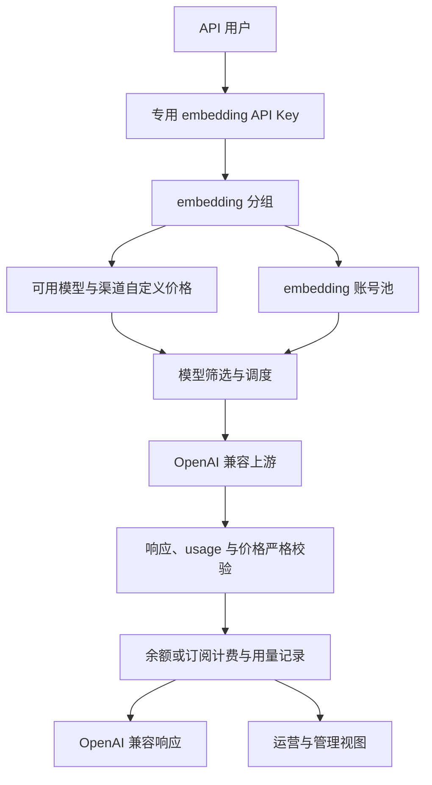
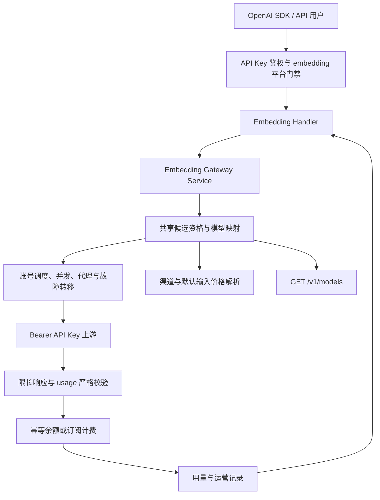
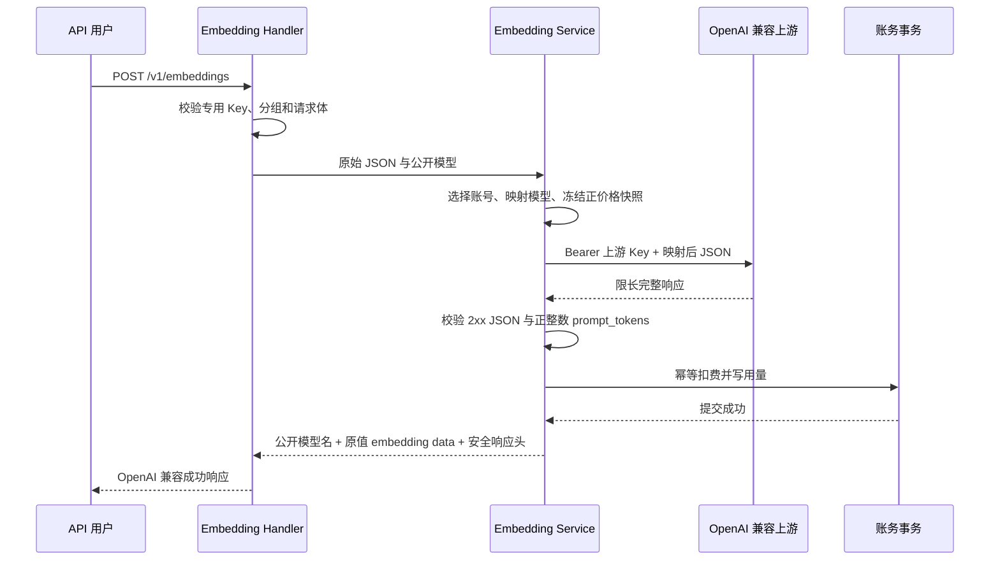
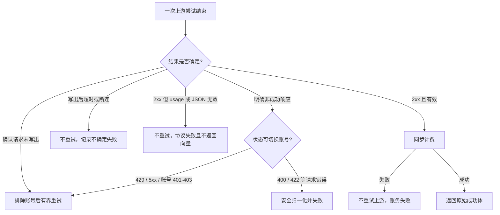
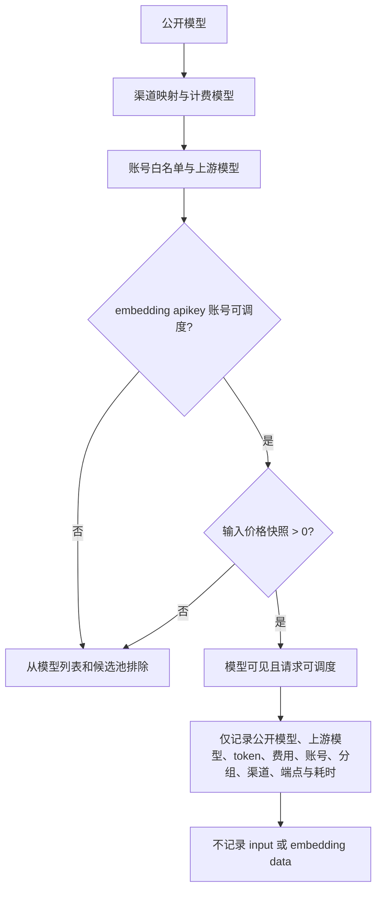

# Embedding Platform - Plan

## Goal Capsule

- **Objective:** 为用户提供独立、OpenAI 兼容且可完整计费的 embedding 平台，覆盖从资源配置到调用、运营和文档的完整生命周期。
- **Product authority:** 本文的 Product Contract 是产品行为与上线范围的唯一依据；不接受只交付协议层或管理链路不完整的版本。
- **Execution profile:** 按 U-ID 依赖顺序完成后端资源治理、模型与价格资格、转发计费、管理端、用户端和发布验证；任何 U-ID 不得作为独立灰度功能先行上线。
- **Stop conditions:** 发现必须改变已确认产品行为、无法保证成功前同步计费、或无法证明日志不含输入和向量时停止实施并报告。
- **Tail ownership:** 实现方负责完成 Verification Contract、清理失败方案残留、提交变更并守护 CI；计划文件不记录执行进度。
- **Open blockers:** 无。

---

## Product Contract

### Summary

新增独立的 `embedding` 平台，通过专用用户 API Key 提供 OpenAI 兼容的 embedding 转发能力。
该平台必须同时具备账号、分组、模型、渠道价格、调度、计费、用量、运营和文档闭环后才能上线。

### Problem Frame

用户希望通过现有网关体系调用 embedding，但仓库当前没有可用的 `/v1/embeddings` 路由或处理链路。
现有账号、分组、API Key 调度和计费能力按聊天平台组织，无法为 embedding 提供独立的权限边界、上游账号池和严格计费。

直接调用上游会绕开平台的分组隔离、模型治理、余额或订阅扣费、用量记录和运营观测。
本需求需要补齐整条产品链路，而不是只增加一个转发端点。

### Actors

- A1. **API 用户：** 使用专用 API Key 查询可用模型并请求 embeddings。
- A2. **管理员或运营人员：** 配置 embedding 账号、分组、渠道模型价格、模型映射和运行状态。
- A3. **OpenAI 兼容上游：** 接收 Bearer API Key 鉴权的 embedding 请求并返回标准响应与用量。

### Key Decisions

- **端到端采用 OpenAI 兼容协议。** `(session-settled: user-directed — chosen over multi-provider protocol adaptation or a fixed provider: 统一接口且不按上游厂商区分平台。)` Governs R1, R3, R5.
- **账号和分组都使用独立的 `embedding` 平台。** `(session-settled: user-directed — chosen over account-only tagging or a global embedding pool: 保持现有分组隔离和账号调度边界。)` Governs R2, R6, R7.
- **用户为 embedding 使用独立 API Key。** `(session-settled: user-directed — chosen over multi-group keys or a user-level default embedding group: 避免扩大现有单 Key 单分组权限模型。)` Governs R2, R8.
- **模型继续使用白名单和映射。** `(session-settled: user-directed — chosen over unrestricted forwarding or a group-fixed model: 同一公开模型名可以安全调度到不同上游账号。)` Governs R9, R10, R12.
- **用量和价格都采用严格校验。** `(session-settled: user-directed — chosen over local token estimation, fixed per-request pricing, or zero-cost fallback: 每个成功请求都必须具备可核验的输入 token 和价格。)` Governs R14, R15, R16.
- **上游鉴权仅支持标准 Bearer API Key。** `(session-settled: user-directed — chosen over configurable header names or arbitrary static headers: 控制认证兼容面和凭证管理成本。)` Governs R4.
- **按完整产品闭环一次上线。** `(session-settled: user-directed — chosen over API-only or endpoint-only delivery: 管理、计费和运营能力缺一不可。)` Governs R6, R11, R17, R18, R19, R20.
- **渠道模型自定义价格属于首发范围。** 现有渠道价格覆盖默认模型价格的产品语义必须适用于 embedding。 Governs R15.

### Requirements

**Public API and access**

- R1. 系统必须提供经过用户 API Key 鉴权的 `POST /v1/embeddings`，并以 OpenAI 官方 [Create embeddings](https://developers.openai.com/api/reference/resources/embeddings/methods/create) 参考为请求与响应协议权威。
- R2. 只有绑定到有效 `embedding` 分组的用户 API Key 才能访问 embedding 接口，其他平台分组不得跨平台调度。
- R3. 系统必须保留 OpenAI 标准请求字段的语义，并只做已配置的模型映射，不转换为厂商专有协议。
- R4. embedding 上游账号必须要求 `base_url` 和 API Key，账号类型固定为 `apikey` 并通过 `Authorization: Bearer <api_key>` 鉴权；管理接口和界面不得允许其他认证类型。
- R5. 标准成功响应和上游错误必须保持 OpenAI 兼容形态，同时不得向用户暴露上游凭证或内部调度信息。

**Resource and model governance**

- R6. 账号与分组的创建、编辑、列表、筛选、批量操作、摘要和关联流程必须完整支持 `embedding` 平台。
- R7. 现有账号、分组和用户 API Key 不自动迁移为 embedding 资源，管理员必须显式建立新的 embedding 链路。
- R8. 用户必须为 embedding 创建独立 API Key，现有聊天 Key 不增加第二个平台或第二个分组绑定。
- R9. `GET /v1/models` 必须只返回当前 Key 所属 embedding 分组中可调度、受模型白名单支持且具备大于零输入价格的模型。
- R10. 系统必须按请求模型执行白名单筛选与模型映射，并在对用户可见的响应和用量记录中保留公开模型名。
- R11. 管理员必须能够测试 embedding 账号的连接、Bearer 鉴权、模型映射、标准响应和用量字段是否满足上线条件。

**Scheduling and forwarding**

- R12. 系统必须只从支持目标模型的可用 embedding 账号中调度，并继续遵守现有优先级、并发、代理、暂停、冷却和可调度状态规则。
- R13. 可重试的上游失败必须参与现有账号切换与故障转移；同一用户请求无论尝试多少账号都只能产生一次成功计费。

**Pricing, billing, and observability**

- R14. 成功的上游响应必须包含正整数 `usage.prompt_tokens`，该值是 embedding 的唯一计量来源；缺失或无效用量不得返回成功结果。
- R15. embedding 必须使用现有模型定价解析顺序，其中渠道管理的模型自定义输入价格覆盖默认模型价格，并继续应用分组倍率与账号倍率各自的现有计费或统计语义。
- R16. 请求模型无法解析出大于零的输入 token 价格时不得返回成功结果、不得按零费用放行，也不得生成伪造用量。
- R17. embedding 用量必须进入现有余额、订阅、配额、费率限制和幂等扣费链路，并以独立请求类型参与账务记录。
- R18. 用量日志必须记录公开模型、上游模型、输入 token、费用、账号、分组、渠道、端点和耗时，但不得保存输入文本或返回向量。
- R19. 管理端用量、运营仪表盘、平台筛选、账号状态和错误观测必须纳入 `embedding`，且能区分成功、严格校验失败和上游失败。

**Release completeness**

- R20. embedding 的中英文界面文案、管理入口、用户调用说明、错误说明和 OpenAI SDK 示例必须随上述能力一起发布，任何未满足的 R-ID 都阻止上线。

### End-to-End Shape

### Key Flows

- F1. 管理员建立 embedding 链路
  - **Trigger:** A2 准备开放一个 embedding 模型。
  - **Actors:** A2, A3
  - **Steps:** 创建 embedding 分组和 API Key 上游账号，配置模型白名单或映射及渠道模型输入价格，关联账号并完成账号测试。
  - **Outcome:** 分组拥有可调度且可计费的模型与账号池。
  - **Covered by:** R4, R6, R9, R10, R11, R15.
- F2. 用户发现并调用模型
  - **Trigger:** A1 使用专用 embedding API Key 查询模型或提交 embedding 请求。
  - **Actors:** A1
  - **Steps:** 系统按 Key 所属分组返回可用模型，并按请求模型完成白名单校验、映射和账号调度。
  - **Outcome:** 请求只进入对应 embedding 账号池。
  - **Covered by:** R1, R2, R8, R9, R10, R12.
- F3. 转发、校验和计费
  - **Trigger:** 系统选中可用账号。
  - **Actors:** A1, A3
  - **Steps:** 使用 Bearer API Key 转发标准请求，校验响应用量与有效价格，完成一次余额或订阅扣费后返回结果。
  - **Outcome:** 每个成功结果都有完整、可追溯且非零费用兜底的账务记录。
  - **Covered by:** R3, R4, R5, R14, R15, R16, R17, R18.
- F4. 上游失败与故障转移
  - **Trigger:** 选中账号返回可重试失败或不可用。
  - **Actors:** A1, A3
  - **Steps:** 系统按既有调度规则尝试其他合格账号，并在所有候选失败后返回兼容错误。
  - **Outcome:** 失败尝试不重复计费，成功重试只产生一次用量。
  - **Covered by:** R5, R12, R13, R17.
- F5. 运营观察
  - **Trigger:** A2 查看 embedding 的用量、费用、账号状态或错误。
  - **Actors:** A2
  - **Steps:** 管理和运营视图按 embedding 平台展示请求、模型、token、费用、账号和错误元数据。
  - **Outcome:** A2 无需读取数据库或请求正文即可定位可用性与计费问题。
  - **Covered by:** R18, R19.

### Acceptance Examples

- AE1. **Covers R1, R3, R5.**
  - **Given:** 用户持有有效 embedding API Key，并提交包含标准模型和输入的 OpenAI embeddings 请求。
  - **When:** 系统完成转发。
  - **Then:** 用户收到 OpenAI 兼容响应，且请求字段语义未被厂商适配逻辑改变。
- AE2. **Covers R2, R8.**
  - **Given:** 用户使用绑定到聊天平台分组的 API Key。
  - **When:** 用户调用 `/v1/embeddings`。
  - **Then:** 系统拒绝跨平台访问，不从 embedding 账号池调度。
- AE3. **Covers R4, R11.**
  - **Given:** 管理员创建 embedding 账号。
  - **When:** 账号使用 OAuth、自定义鉴权头，或缺少 `base_url` 与 API Key 中的任一项。
  - **Then:** 创建或测试失败；完整的标准 Bearer API Key 配置可通过测试。
- AE4. **Covers R9, R10.**
  - **Given:** 分组内两个账号通过映射支持同一个公开模型，另一个模型没有可调度账号或有效价格。
  - **When:** 用户查询模型并请求该公开模型。
  - **Then:** 模型列表只展示可用且有价格的公开模型，请求可映射到任一合格上游模型。
- AE5. **Covers R12, R13.**
  - **Given:** 首选账号返回可重试上游错误，备用账号可用。
  - **When:** 系统执行故障转移并由备用账号成功返回。
  - **Then:** 用户获得一个成功响应，只有备用账号对应的一次成功用量进入计费。
- AE6. **Covers R14, R15, R17, R18.**
  - **Given:** 上游返回有效 `usage.prompt_tokens`，请求模型具备有效价格。
  - **When:** 系统返回 embeddings。
  - **Then:** 输入 token、费用、余额或订阅用量及关联元数据被一致记录。
- AE7. **Covers R14, R16.**
  - **Given:** 上游返回 embeddings 但缺失或伪造为无效的 `usage.prompt_tokens`。
  - **When:** 系统校验响应。
  - **Then:** 用户收到兼容错误，不获得成功结果，系统不按估算 token 或零费用记账。
- AE8. **Covers R15, R16.**
  - **Given:** 请求模型没有大于零的默认价格，也没有匹配且大于零的渠道自定义价格。
  - **When:** 用户提交 embedding 请求。
  - **Then:** 请求被拒绝，不向用户交付未计价的 embeddings。
- AE9. **Covers R15, R17.**
  - **Given:** 同一模型同时存在默认输入价格和当前渠道的自定义输入价格。
  - **When:** 请求成功并产生输入 token。
  - **Then:** 用户费用采用渠道自定义价格，并按现有规则应用分组倍率和账号统计倍率。
- AE10. **Covers R18, R19.**
  - **Given:** embedding 请求成功或失败。
  - **When:** 管理员查看用量和运营视图。
  - **Then:** 页面能按 embedding 平台定位模型、token、费用、账号和错误，但任何日志与视图都不包含输入文本或向量。
- AE11. **Covers R20.**
  - **Given:** 公开 API 已可调用，但管理测试、渠道价格、用量运营或使用文档中的任一能力尚未完成。
  - **When:** 团队评估是否上线。
  - **Then:** 该版本不满足发布条件。

### Success Criteria

- OpenAI SDK 可使用专用用户 API Key 完成模型查询与 embeddings 请求，无需厂商专有适配。
- 每个成功 embedding 请求都能关联有效 `prompt_tokens`、定价来源、扣费结果和用量日志，不存在缺用量或缺价格的成功响应。
- 管理员可仅通过现有管理与运营界面完成资源配置、账号验证、价格管理和问题定位。
- 输入文本和返回向量不进入持久化用量或运营日志。

### Scope Boundaries

- Per R3 and R4, 不支持厂商专有 embedding 协议、OAuth、可配置鉴权头或任意静态 headers。
- 不建设向量存储、相似度检索、RAG 编排、rerank 或其他向量应用层能力。
- Per R8, 不支持同一用户 API Key 同时绑定聊天与 embedding 平台。
- Per R7, 不自动迁移或重新解释现有账号、分组和用户 API Key。
- Per R20, 不采用协议层先行、管理能力后补的分阶段上线方式。
- 本次幂等边界保证一次网关请求的内部故障转移和账务重入只提交一次；不新增非 OpenAI 标准的客户端幂等头、响应向量缓存或跨 HTTP 请求重放。客户端重复提交按独立请求处理。

### Dependencies / Assumptions

- 上游服务遵循 OpenAI Embeddings API，并在成功响应中提供可信的 `usage.prompt_tokens`。
- 现有渠道模型价格能力继续以输入 token 单价表达 embedding 价格；输出、缓存和图片价格不参与 embedding 费用。
- 现有余额、订阅、配额、调度、渠道映射和运营设施可作为共享产品能力扩展，而不改变其对其他平台的既有行为。
- 用户需求被视为已成立的产品输入；本次讨论未提供调用量、客户数量或直接上游成本等量化证据。

### Sources / Research

| Source | Relevance |
|---|---|
| [OpenAI Create embeddings API Reference](https://developers.openai.com/api/reference/resources/embeddings/methods/create) | `POST /v1/embeddings`、标准 Bearer 鉴权、请求参数以及包含 `prompt_tokens` 和 `total_tokens` 的响应契约。 |
| `backend/internal/server/routes/gateway.go` | 现有用户 API Key 鉴权、平台路由、模型查询与网关接口组织方式。 |
| `backend/internal/handler/endpoint.go` 与 `backend/internal/handler/endpoint_test.go` | 当前端点归一化边界及 `/v1/embeddings` 尚未成为已知端点的证据。 |
| `backend/internal/domain/constants.go` | 现有平台与账号类型常量。 |
| `backend/internal/service/api_key.go` 与 `backend/ent/schema/api_key.go` | 用户 API Key 的单一可空分组绑定。 |
| `frontend/src/types/index.ts` | 现有账号和分组平台类型。 |
| `frontend/src/components/account/CreateAccountModal.vue` | 现有 `base_url`、`api_key` 和模型映射配置的相邻模式。 |
| `backend/internal/service/model_pricing_resolver.go` | 渠道模型价格覆盖默认模型价格的现有解析语义。 |
| `frontend/src/components/admin/channel/PricingEntryCard.vue` | 渠道模型自定义输入价格的现有管理入口。 |
| `backend/internal/service/openai_gateway_service.go` | 现有 OpenAI 用量记录、分组倍率和缺用量或缺价格时的兜底行为。 |
| `backend/internal/service/billing_service.go` | 按输入 token 计算费用的共享计费能力。 |

---

## Planning Contract

### Key Technical Decisions

- KTD1. **保持 embedding 平台与 OpenAI 聊天兼容判断分离。** 新增 `PlatformEmbedding` 和精确平台匹配，但不把它加入 `IsOpenAICompatiblePlatform`；在共享分发入口增加仅针对 `PlatformEmbedding` 的默认拒绝守卫，只放行 `/v1/embeddings`、embedding 分组的 `/v1/models` 和现有 `/v1/usage` 产品路由，其他平台继续沿用既有分派。该边界实现 R2、R4、R8，并避免平台常量扩展意外扩大权限。
- KTD2. **在现有 OpenAI 网关 receiver 上增加专用 embedding 资格、转发和 handler 文件。** POST 与 embedding 分组的 GET `/v1/models` 都分派到同一 receiver 和资格结果，复用其账号仓库、调度、HTTP、定价与账务依赖；通用 `GatewayService` 不再实现第二套 embedding 资格，也不新增平行依赖注入图。该方案实现 R1、R9、R12、R13，并把 embedding 特有规则限制在专属模块。
- KTD3. **只解析必要字段并延迟写出成功响应。** `(session-settled: user-directed — chosen over returning or estimating an unverified upstream result: 每个成功请求都必须先具备可核验的输入 token 和价格。)` 请求只提取公开模型并保持其余 JSON 字段原样，模型映射只修改出站 `model`；响应按独立上限缓冲，用严格数字解析抽取 `usage.prompt_tokens`，同步计费完成后把顶层 `model` 规范为公开模型名，再写出保持原值的 `float` 或 `base64` embedding data 及其他兼容字段。该机制实现 R3、R5、R10、R14、R18。
- KTD4. **模型发现和请求调度共享同一资格判定。** `(session-settled: user-directed — chosen over unrestricted forwarding or listing models that later fail billing: 同一公开模型必须同时可调度且具备正输入价格。)` 候选必须属于 embedding 分组、账号为有效 `apikey`、白名单或映射包含公开模型，并可按现有 Channel → LiteLLM → fallback 顺序冻结一份不可变的完整 `ResolvedPricing`；资格阶段要求 token 模式，且基础价和所有可达区间组合覆盖允许的 token 范围并最终产生正输入价。渠道显式零价继续覆盖默认价并使对应候选或区间失效；收到 `prompt_tokens` 后只从冻结快照选择最终区间价。该判定和价格快照实现 R9、R10、R12、R15、R16。
- KTD5. **故障转移按“结果确定性”而非所有网络错误统一处理。** 明确的 429、5xx、账号 401/403 和 transport 观测证明尚未写出任何请求字节的连接失败可进入既有有界账号切换；任何写入阶段未知或已写出的超时/断连、2xx 协议损坏、缺失用量和本地计费失败均不再次调用上游。请求级自动重试、自动重放和 redirect 全部关闭，禁止按错误字符串猜测写入阶段。该选择实现 R5、R13、R17。
- KTD6. **embedding 扩展现有账务事务，使账务影响与用量行原子提交。** `(session-settled: user-directed — chosen over asynchronous best-effort usage recording or a generic sync-only record: embedding 成功结果必须进入完整账务链路且可独立识别。)` `UsageBillingCommand` 携带可选的不可变 embedding usage row，由同一 SQL transaction 完成 dedup claim、余额或订阅与配额更新、request type 4 用量插入和 commit；任一步失败全部回滚，现有非 embedding 调用在该字段为空时保持原行为。新前向迁移增加 `RequestTypeEmbedding = 4`，原有 sync/stream/ws_v2 值保持不变。该机制实现 R13、R17、R18、R19。
- KTD7. **隐私通过数据流隔离而不是事后清洗保证。** `(session-settled: user-directed — chosen over retaining request or vector payloads for replay/debugging: embedding 日志只能保存非内容元数据。)` embedding 不向 ops request context、重试预览、scheduled test、panic/error 日志或 trace 传递原始请求、响应或上游错误体；客户端错误只含固定分类与本地 request ID。成功响应采用不可被通用 `additional_allowed` 放宽的最小 header allowlist，运营侧对 embedding 禁止 body 预览和“重试原请求”。该机制实现 R5、R18、R19。
- KTD8. **embedding 上游 URL 使用独立的 fail-closed SSRF 策略。** 创建、更新、导入、测试和运行时都要求 HTTPS、允许的目标 host 与解析后 IP；运行时由共享 HTTP port 的 embedding 请求级策略把校验通过的具体 IP 绑定到实际 dial，同时保留原 host 的 TLS SNI 与 HTTP Host。loopback、link-local、metadata 和保留地址始终禁止；私网只允许部署者显式配置的 host/CIDR；无法保持同等目标约束的代理直接拒绝；全部 redirect 禁止。该策略不继承当前全局 URL allowlist 的宽松默认值，实现 R4、R5、R11。
- KTD9. **embedding 使用独立且有硬上界的资源预算。** 在通用 256 MiB 网关 body limit 之前施加更小的 request cap，并对解压后 response、JSON 深度、input 项数、单项大小、token 数值范围、上游 header/body timeout 和并发准入设置配置默认值与不可突破的硬上界；不硬编码某个上游模型的 tokenizer 限额。该策略实现 R3、R5、R12。

### High-Level Technical Design

以下图示是本计划的权威实现形状；具体 helper 名称可在实现时按仓库约定调整。

#### Component topology

#### Protocol and billing sequence

#### Failover decision flow

#### Eligibility and observability data flow

### Assumptions

- 账号与分组的 `platform` 保持字符串字段；新增 `embedding` 不修改 Ent schema，也不把字段改为 enum。
- embedding 直接扩展现有网关 receiver 与依赖，预计不需要 Wire 生成；只有实现确实改变构造器签名时才重新生成 `cmd/server` 注入代码。
- CI 使用本地 mock OpenAI 兼容上游验证协议和账务，不要求真实上游凭证；管理员连接测试由运行时显式选择白名单模型执行最小无敏感输入请求。
- `RequestTypeEmbedding = 4` 是非流式 embedding 的账务特化值；现有 transport request type 查询保持兼容，不新增第二个 operation-type 列。
- 本功能不顺带升级已进入维护末期的 `vue-i18n`；中英文文案继续使用仓库现有组合式 API 和覆盖检查。

### System-Wide Impact

- **Authentication and authorization:** 用户 Key 仍保持单 Key 单分组；共享路由分发前增加 `PlatformEmbedding` 默认拒绝守卫，只放行 embeddings、该分组的 models 和现有 usage 路由，其他平台分派保持不变；负向测试覆盖 `/v1`、无前缀别名、通配子路径、WebSocket、Gemini 和强制平台路由，拒绝必须发生在模型查询或调度之前。
- **Data and migrations:** 仅新增前向 request type 迁移；现有账号、分组、Key 和用量记录不回填、不重分类。
- **Scheduling and capacity:** embedding 复用账号优先级、并发、代理、暂停、冷却和快照基础设施，但账号资格始终要求专用平台与 `apikey`。
- **Billing and consistency:** 成功响应改为原子账务事务提交后的结果；dedup、余额或订阅与配额、type 4 usage row 要么同时提交一次，要么全部回滚。请求期间价格变化不影响已冻结快照，故障转移只使用最终成功账号对应的快照和一次 request ID。
- **Operations and privacy:** 平台、request type、端点和严格校验失败进入筛选与错误观测；原始输入、向量、凭证、上游错误体和可能携带 canary 的响应头不进入持久化、trace、账号状态或可重放面。
- **Network security:** embedding 账号的 URL 与代理走 KTD8 的独立 fail-closed 策略；解析结果必须绑定实际 dial，发布环境必须显式确认允许 host/CIDR、DNS/IP 策略和私网开关，禁止自动 redirect 与 credential forwarding。
- **Resource control:** body limit 之前执行并发和速率准入，解压后请求/响应与慢上游都受 KTD9 的硬上界保护，所有失败出口释放用户与账号槽。
- **User and admin interfaces:** 平台联合类型、颜色和图标、账号与分组表单、渠道价格、用量筛选、Key 使用说明和中英文文案必须同步，不能只补创建入口。

### Risks & Dependencies

| Risk / dependency | Mitigation |
|---|---|
| 任意 `base_url`、DNS rebinding、redirect 或代理造成 SSRF 与 Bearer 凭证中继 | 按 KTD8 在所有资源和运行时入口复验 HTTPS、host 与解析 IP，私网显式开启，禁用 redirect，并以 metadata/loopback/private/DNS 变体做负向测试。 |
| 缓冲请求与 embedding 响应造成内存、解压或慢连接耗尽 | 按 KTD9 使用独立 request/解压后 response/JSON 结构/timeout 硬上界，先做并发准入，及时关闭 body 并覆盖压缩炸弹与慢读测试。 |
| 客户端自动重试、redirect 或共享 client 凭证造成重复成本或串号 | 请求级关闭自动重试、重放和 redirect，使用绝对 URL 与请求级 Bearer，并以 transport write phase 决定是否允许账号切换。 |
| 渠道显式零价被默认价格覆盖 | 以渠道字段存在性而非非零值判断覆盖，资格函数最终要求 token 模式和正输入价。 |
| 模型列表与实际调度规则漂移 | 两条路径调用同一资格判定，并用模型列表到真实请求的集成场景锁定。 |
| dedup、账务影响或 usage insert 部分成功 | 扩展同一 SQL transaction 原子提交可选 usage row，注入每一步与 commit 失败并断言“一次扣费+一条日志”或“两者都无”。 |
| 上游已计费但本地事务提交结果未知 | 不返回向量、不重调上游，以同一 request ID/fingerprint 查询幂等结果并进入无内容对账路径。 |
| 上游或账号测试回显 input、vector 或 Key | embedding 使用固定错误分类与最小响应头，禁止 raw body/detail/event/status 文本持久化，并用多位置 canary 测试日志、ops、SSE、trace 和账号状态。 |
| 平台类型扩展遗漏某个穷尽映射 | 依赖 TypeScript typecheck、前端 build、平台颜色/图标单测和后端平台矩阵测试发现缺口。 |
| 管理测试消耗上游 token | 仅使用管理员显式选择的白名单模型和最小固定非敏感输入，展示该测试会调用上游但不进入用户账单。 |

### Documentation and Operational Notes

- `README.md`、`README_CN.md` 与 Key 使用弹窗共同说明专用 Key、模型发现、请求示例、Bearer-only 上游边界、正用量和正价格门禁，以及不记录输入和向量的承诺。
- 发布检查必须确认数据库前向迁移已经应用，运营筛选出现 embedding，且账号连接测试通过后才向用户发放专用 Key。
- 现有第一代 OpenAI embedding 模型已经下线，不加入默认模型或示例；模型来源只使用管理员白名单和映射。

---

## Implementation Units

### U1. Establish the embedding platform and resource contract

- **Goal:** 让账号、分组、关联和调度基础设施认识独立 `embedding` 平台，并在所有写入口强制上游账号为完整的 `apikey` 配置。
- **Requirements:** R2, R4, R6, R7, R8, R12; F1, F2; AE2, AE3.
- **Dependencies:** 无。
- **Files:**
  - `backend/internal/domain/constants.go`
  - `backend/internal/service/domain_constants.go`
  - `backend/internal/service/account.go`
  - `backend/internal/service/account_service.go`
  - `backend/internal/service/admin_service.go`
  - `backend/internal/service/openai_account_scheduler.go`
  - `backend/internal/service/scheduler_snapshot_service.go`
  - `backend/internal/service/account_service_test.go`
  - `backend/internal/service/admin_service_test.go`
  - `backend/internal/service/openai_account_scheduler_test.go`
  - `backend/internal/service/scheduler_snapshot_service_test.go`
- **Approach:**
  1. 新增平台常量、严格账号凭证访问器和精确的账号—分组兼容规则，按 KTD1 保持聊天兼容集合不变。
  2. 在创建、更新、导入、批量操作和关联校验中统一执行 R4 与 KTD8；空白或不安全 `base_url`、API Key、空模型白名单或非 `apikey` 都不能形成可调度资源。
  3. 为调度器新增独立于聊天兼容判断的 supported-platform 归一化，使 embedding 只查询同平台 API Key 账号，并继续复用优先级、并发、代理、暂停和冷却状态。
  4. 把 embedding 加入调度快照的固定平台集合、重建与失效路径，保证启动和分组变更后无需冷路径兜底。
- **Patterns to follow:** `AccountCanBelongToGroupPlatform`、OpenAI API Key credential helpers、`openAICompatibleSchedulerAccountPlatforms` 的候选过滤结构。
- **Test scenarios:**
  - Covers AE3. 创建或更新 `embedding` 账号时，只有 `type=apikey` 且 `base_url`、API Key、模型白名单齐全的 payload 成功。
  - Covers AE2. embedding 分组不能关联聊天账号，聊天分组不能关联 embedding 账号，现有资源不会自动改变平台。
  - embedding 调度只返回同分组、同平台、支持目标公开模型且状态可调度的账号。
  - 启动、账号或分组更新与快照重建后，embedding 候选集合即时刷新且不混入 OpenAI/Codex2API。
  - OAuth、setup-token、upstream、自定义认证头、空白凭证和未配置模型映射均在调用上游前失败。
- **Verification:** 所有资源写入口产生一致校验结果，现有 OpenAI/Anthropic/Gemini/Antigravity 关联和调度测试保持通过。

### U2. Unify model eligibility, mapping, and positive pricing

- **Goal:** 让 `/v1/models` 与实际请求共用可调度、白名单、映射和正输入价判定，并保留公开模型身份。
- **Requirements:** R9, R10, R12, R15, R16; F1, F2; AE4, AE8, AE9.
- **Dependencies:** U1.
- **Files:**
  - `backend/internal/service/model_pricing_resolver.go`
  - `backend/internal/service/openai_embedding_eligibility.go`
  - `backend/internal/service/openai_embedding_eligibility_test.go`
  - `backend/internal/service/model_pricing_resolver_test.go`
- **Approach:**
  1. 在 OpenAI receiver 的专属资格模块中建立 KTD4 的共享结果，携带公开模型、渠道映射、账号映射、上游模型和冻结的完整 `ResolvedPricing`；模型发现与 POST 都消费它。
  2. 复用 `ModelPricingResolver`，但拒绝非 token 模式，并验证基础价与所有可达区间组合对允许 token 范围均能产生正输入价；渠道字段存在时保持覆盖语义，包括显式零价。收到上游 `prompt_tokens` 后通过 `GetIntervalPricing` 从冻结快照选择最终输入价，不重新读取价格配置。
  3. embedding 分组的 `/v1/models` 不使用任何默认模型 fallback，只返回至少一个合格候选的公开模型；通用 `GatewayService` 保持现有平台行为。
- **Patterns to follow:** `ResolveChannelMappingAndRestrict`、`ModelPricingResolver.Resolve`、`GetAvailableModels` 的缓存和失效方式。
- **Test scenarios:**
  - Covers AE4. 两个账号将同一公开模型映射到不同上游模型时，列表只出现一次公开模型且两者均可成为候选。
  - Covers AE8. 默认价和渠道价都缺失或最终输入价为零时，模型不展示且请求在上游调用前失败。
  - Covers AE9. 渠道自定义输入价覆盖默认价，分组倍率与账号统计倍率保持现有语义。
  - 渠道显式零价、区间边界/空洞、非 token 计费模式、空白映射目标和账号变为不可调度时，缓存失效后模型资格同步变化；并证明区间价格按成功响应的 token 数从请求级快照选取。
- **Verification:** 模型列表与请求资格在相同 fixture 下完全一致，定价来源和公开/上游模型链可进入后续用量记录。

### U3. Implement lossless forwarding and safe failover

- **Goal:** 使用上游 Bearer API Key 完成 OpenAI 兼容、限长、非流式 embedding 转发，并只在结果确定时切换账号。
- **Requirements:** R3, R4, R5, R12, R13, R14, R18; F3, F4; AE1, AE5, AE7.
- **Dependencies:** U1, U2.
- **Files:**
  - `backend/internal/service/openai_embeddings.go`
  - `backend/internal/service/openai_embeddings_test.go`
  - `backend/internal/service/http_upstream_port.go`
  - `backend/internal/repository/http_upstream.go`
  - `backend/internal/repository/http_upstream_test.go`
  - `backend/internal/config/config.go`
  - `backend/internal/config/config_test.go`
- **Approach:**
  1. 请求只读取一次 raw JSON，校验 `model` 和 `input` 的必要结构，按资格结果替换出站模型，原样保留 `encoding_format`、`dimensions`、`user`、token 数组和兼容扩展字段。
  2. 扩展共享 HTTP port 的请求级策略并按 KTD8 复验 URL、解析 IP、proxy 和 host，将校验 IP 固定到实际 dial 且保留原 host 的 TLS SNI/Host；使用 endpoint builder 兼容 root、`/v1` 和完整 endpoint，请求级设置 Bearer，关闭全部 redirect、自动重试与重放，不转发入站 Authorization。
  3. 按 KTD9 在读取和 JSON 解码前执行独立 request/response/结构/timeout 上限；2xx 只接受 JSON 中可安全表示的正整数 `usage.prompt_tokens`，原始 `float` 或 `base64` 数据保持字节级不变。
  4. 为每次尝试保留可靠的 transport write phase；按 KTD5 只在零请求字节写出得到证明时切换 transport failure，未知阶段一律不重试，所有出口释放 body 与账号槽。
  5. 成功只携带固定最小响应头；上游错误、redirect、header 和 body 全部经过 KTD7 的无内容边界。
- **Patterns to follow:** `ReadUpstreamResponseBody`、OpenAI URL builder、代理 client 选择、`UpstreamFailoverError` 与账号排除循环。
- **Test scenarios:**
  - Covers AE1. 字符串、字符串数组、token 数组和二维 token 数组均透明转发，只有模型字段按配置改变。
  - `encoding_format=float` 与 `base64` 的 embedding data 保持原值，顶层 `model` 恢复为公开模型名，其他兼容字段不丢失。
  - Covers AE7. `prompt_tokens` 缺失、null、字符串、小数、零、负数或溢出时不返回向量、不计费且不切换账号。
  - Covers AE5. 明确 429/5xx 可切换到备用账号；400/422、请求写出后的超时或断连、2xx 协议损坏均不重试。
  - root、带 `/v1`、尾斜杠和完整 endpoint 的 `base_url` 只生成一个 `/v1/embeddings`，入站 Key 与上游 Key 不出现在响应或日志。
  - loopback、RFC1918、link-local/metadata、IPv6/十进制变体、DNS 解析到私网或 rebinding、redirect 到非允许 host，以及代理绕过尝试均在发送 Bearer 前失败。
  - dial、TLS、写 header、半 body、完整 body、等待 header 和读取 body 各阶段失败时，上游调用次数严格符合 KTD5。
  - 超大字符串、巨量或深层 token 数组、未知扩展深度、压缩炸弹、慢 header/body 和并发超限安全失败，无部分响应或账务且槽位归还。
- **Verification:** mock 上游可证明每种失败的真实调用次数、账号切换结果、请求头与原始响应字节，且并发槽在所有出口释放。

### U4. Add the public route and synchronous idempotent billing

- **Goal:** 将专用路由接入现有鉴权、余额或订阅预检、并发和幂等账务链路，只有账务提交成功才交付向量。
- **Requirements:** R1, R2, R5, R13, R14, R15, R16, R17, R18, R19; F2, F3, F4; AE2, AE5, AE6, AE7, AE8, AE9, AE10.
- **Dependencies:** U2, U3.
- **Files:**
  - `backend/internal/server/routes/gateway.go`
  - `backend/internal/server/routes/gateway_test.go`
  - `backend/internal/handler/endpoint.go`
  - `backend/internal/handler/endpoint_test.go`
  - `backend/internal/handler/openai_embeddings.go`
  - `backend/internal/handler/openai_embeddings_test.go`
  - `backend/internal/handler/ops_error_logger.go`
  - `backend/internal/service/openai_gateway_service.go`
  - `backend/internal/service/gateway_service.go`
  - `backend/internal/service/usage_billing.go`
  - `backend/internal/service/usage_log.go`
  - `backend/internal/service/usage_log_test.go`
  - `backend/internal/repository/usage_log_repo.go`
  - `backend/internal/repository/usage_log_repo_request_type_test.go`
  - `backend/internal/repository/usage_billing_repo.go`
  - `backend/internal/repository/usage_billing_repo_unit_test.go`
  - `backend/internal/repository/usage_billing_repo_integration_test.go`
  - `backend/migrations/129_add_embedding_request_type.sql`
  - `backend/internal/repository/migrations_schema_integration_test.go`
- **Approach:**
  1. 注册 `POST /v1/embeddings` 并使用 embedding 专属 body limit、request ID、ops error、API Key 和分组中间件；在共享路由分发前执行 KTD1 的 `PlatformEmbedding` 默认拒绝守卫，并把 embedding `/v1/models` 分派到 U2 的资格结果。`run_mode=simple` 在任何候选查询和上游调用前返回固定不支持错误；首发严格计费仅在 `run_mode=standard` 开放。
  2. 在上游前执行现有 billing eligibility 与用户并发预检，在有效结果后按价格快照构造输入 token 单价账务命令。
  3. 扩展 `UsageBillingCommand` 的可选 usage row，并在同一 transaction 完成 fingerprint 冲突检查、账务影响和 `RequestTypeEmbedding` 插入；commit 成功后才写客户端响应，现有调用传空值时保持原逻辑。
  4. 新建前向迁移扩展 `usage_logs_request_type_check`，不修改历史迁移；ops error context 同步识别 request type 4，但不保存 body。
- **Patterns to follow:** `BillingCacheService.CheckBillingEligibility`、`applyUsageBilling`、migration 061 的约束形状、endpoint normalization 和 OpenAI error envelope。
- **Test scenarios:**
  - Covers AE2. endpoint × platform 双向矩阵覆盖 messages/count_tokens、chat、responses 子路径与无前缀别名、Responses WebSocket、images、Gemini v1beta、Antigravity force-platform、models 和产品允许的 usage；所有拒绝发生在查询候选前。
  - Covers AE6. 有效正整数 token 和价格在余额模式、订阅模式、API Key quota 与时间窗限额下产生一致用量。
  - Covers AE5. 备用账号成功时只有最终账号的一条 request type 4 记录，重复账务提交由 request ID 幂等跳过。
  - Covers AE7 / AE8. 无效 usage、无价格、显式零价、账务事务失败和余额或订阅预检失败均不返回成功体。
  - `run_mode=standard` 完成完整账务链路；`run_mode=simple` 在模型查询、候选调度和上游调用前拒绝 embedding，且 README 与发布检查明确该限制。
  - 客户端在上游有效响应后断开时账务仍只提交一次；账务失败或 commit 结果未知不触发第二次上游请求。
  - 在 dedup 后、余额/订阅/配额更新后、usage insert 和 commit 注入失败时，只能观测到“一次扣费+一条 type 4 log”或“两者都无”；同一网关 request ID 的并发账务提交幂等，异 fingerprint 冲突失败。
  - migration 显式替换 061 的旧 CHECK，在空库和已有 0-3 数据上可重复应用，值 4 可写入与筛选，其他非法值仍受约束。
- **Verification:** HTTP 集成测试从真实中间件走到 mock 上游与 SQL 账务仓库，证明“成功响应、单条账务和 request type 4”不可分离。

### U5. Complete admin resource, channel pricing, and account testing surfaces

- **Goal:** 管理员可完整配置、筛选、批量管理、定价并验证 embedding 资源，不暴露不支持的鉴权或价格字段。
- **Requirements:** R4, R6, R9, R10, R11, R15, R19, R20; F1, F5; AE3, AE4, AE9, AE10, AE11.
- **Dependencies:** U1, U2, U3.
- **Files:**
  - `backend/internal/service/account_test_service.go`
  - `backend/internal/service/account_test_service_test.go`
  - `backend/internal/handler/admin/account_handler.go`
  - `backend/internal/handler/admin/account_handler_test.go`
  - `backend/internal/handler/admin/group_handler.go`
  - `backend/internal/handler/admin/group_handler_test.go`
  - `frontend/src/types/index.ts`
  - `frontend/src/components/account/CreateAccountModal.vue`
  - `frontend/src/components/account/EditAccountModal.vue`
  - `frontend/src/components/account/BulkEditAccountModal.vue`
  - `frontend/src/components/account/ModelWhitelistSelector.vue`
  - `frontend/src/components/account/AccountTestModal.vue`
  - `frontend/src/views/admin/AccountsView.vue`
  - `frontend/src/views/admin/GroupsView.vue`
  - `frontend/src/views/admin/ChannelsView.vue`
  - `frontend/src/components/admin/channel/PricingEntryCard.vue`
  - `frontend/src/components/admin/channel/pricingMappings.ts`
  - `frontend/src/components/admin/channel/types.ts`
  - `frontend/src/components/account/__tests__/CreateAccountModal.spec.ts`
  - `frontend/src/views/admin/__tests__/ChannelsView.spec.ts`
- **Approach:**
  1. 扩展前后端平台类型、表单、筛选、摘要、关联与批量选择；embedding 创建和编辑仅展示 API Key、base URL、模型白名单与映射。
  2. 渠道页面新增 embedding 平台顺序与输入价格配置，保持每百万 token 到 per-token 的现有换算；不要求输出、缓存或图片价格。显式零输入价保存时展示行内警告和停用状态，明确它会覆盖默认价并使该渠道模型不可展示、不可调度。
  3. 账号测试使用管理员选择的白名单模型发送最小固定非敏感输入，在 KTD8 的网络策略下验证 Bearer、URL、映射、响应结构和正整数 usage；测试丢弃向量与 raw body，只返回固定状态分类且不进入用户账单。
- **Patterns to follow:** OpenAI API Key 账号表单、`ModelWhitelistSelector`、`PricingEntryCard`、AccountTestModal 的 SSE 状态展示。
- **Test scenarios:**
  - Covers AE3. embedding 账号表单固定提交 `type=apikey`、完整 credentials 和模型映射，不显示或提交 OAuth、自定义 headers 或其他账号类型。
  - Covers AE4. 分组、账号和渠道页面只允许同平台关联，并能创建、编辑、筛选和批量选择 embedding 资源。
  - Covers AE9. 渠道 embedding 输入价完成 UI 单位往返并保存显式零价，后端将零价视为覆盖且不可调度。
  - 显式零价的行内警告、保存结果和模型停用状态一致，管理员不会把零价误解为可调用的免费模型。
  - 账号连接测试对有效 float/base64 响应成功，对错误 Bearer、映射、缺 usage、零 usage、非 JSON、SSRF/redirect 和恶意回显给出无敏感信息的固定失败分类。
  - 定时与手动账号测试在 SSE、账号 error_message、日志和 ops 字段中都不保存 input、vector、上游 body 或两类 Key canary。
- **Verification:** 管理员可从空配置建立完整链路，前端 payload 与后端校验一致，账号测试不会生成用户 usage log。

### U6. Add user guidance, usage visibility, operations, and localization

- **Goal:** 用户和运营人员能发现、调用并观察 embedding，所有界面和文档同时提供中英文完整说明。
- **Requirements:** R9, R18, R19, R20; F2, F5; AE10, AE11.
- **Dependencies:** U4, U5.
- **Files:**
  - `frontend/src/components/keys/UseKeyModal.vue`
  - `frontend/src/views/user/KeysView.vue`
  - `frontend/src/views/user/UsageView.vue`
  - `frontend/src/views/admin/UsageView.vue`
  - `frontend/src/views/admin/ops/OpsDashboard.vue`
  - `frontend/src/utils/usageRequestType.ts`
  - `frontend/src/utils/platformColors.ts`
  - `frontend/src/components/common/PlatformIcon.vue`
  - `frontend/src/components/common/PlatformTypeBadge.vue`
  - `frontend/src/i18n/locales/zh.ts`
  - `frontend/src/i18n/locales/en.ts`
  - `frontend/src/utils/__tests__/usageRequestType.spec.ts`
  - `frontend/src/components/keys/__tests__/UseKeyModal.spec.ts`
  - `README.md`
  - `README_CN.md`
- **Approach:**
  1. 为 embedding Key 提供 `GET /v1/models`、curl 和 OpenAI SDK 调用示例，明确专用 Key 与支持边界。
  2. 用量与运营视图增加 embedding 平台、request type 4、模型、token、费用、账号、分组、渠道、端点和失败类别筛选；按 KTD7 禁用原请求重放、body/detail/event 预览和上游错误文本展示。管理员详情改为安全元数据状态，只显示固定失败类别、本地 request ID、时间、公开/上游模型、账号、分组、渠道、端点和耗时，并明确提示内容预览不可用。
  3. 延续现有分层 DTO：用户 usage 响应只含公开模型、token、费用、request type、公开端点与状态；上游模型、账号、渠道、映射链和内部失败分类只进入管理员接口，后端 JSON 契约测试证明用户响应不含这些字段。
  4. 补齐平台图标、颜色、标签和中英文文案，并使 README 与界面错误说明保持一致；文档明确 `run_mode=simple` 不开放 embedding。
- **Patterns to follow:** `UseKeyModal` 的平台分支、`usageRequestType` 兼容映射、现有 OpsDashboard 平台过滤器和 locale coverage。
- **Test scenarios:**
  - embedding Key 弹窗生成正确 base URL、专用 Key、模型发现和 SDK/curl 示例，不生成聊天客户端配置。
  - Covers AE10. 成功、usage 校验失败、价格失败和上游失败可按 embedding 定位，页面不渲染 input、向量或凭证。
  - 恶意上游在 2xx/4xx/5xx body、非 JSON、响应头和 redirect 中回显 canary 时，用户错误、ops、trace、metrics、账号状态与 UI 都不出现 canary。
  - request type 4 在管理端与用户端显示为 embedding，旧 0-3 值和历史 fallback 行仍保持原标签。
  - 中英文 locale coverage、平台图标/颜色穷尽映射和 README 链接均通过静态验证。
- **Verification:** API 用户无需额外说明即可完成模型发现和调用，运营人员无需查询数据库即可区分主要失败类型且没有内容重放入口。

### U7. Prove full-stack release completeness

- **Goal:** 用跨层测试和发布检查证明所有首发能力同时完成，且没有破坏现有平台。
- **Requirements:** R1-R20; F1-F5; AE1-AE11.
- **Dependencies:** U1, U2, U3, U4, U5, U6.
- **Files:**
  - `backend/internal/integration/embedding_gateway_test.go`
  - `backend/internal/integration/embedding_billing_test.go`
  - `backend/internal/server/routes/gateway_test.go`
  - `frontend/src/views/admin/__tests__/GroupsView.spec.ts`
  - `frontend/src/views/admin/__tests__/UsageView.spec.ts`
  - `frontend/src/views/user/__tests__/UsageView.spec.ts`
- **Approach:**
  1. 以本地 mock 上游和真实中间件/数据库组合覆盖配置、模型发现、请求、故障转移、账务、用量和运营查询闭环。
  2. 运行现有平台回归，审计 diff 中所有请求体、响应体、header 和 credential 日志路径，并验证迁移、事务故障矩阵、endpoint × platform 矩阵与 SSRF/resource 边界。
  3. 把 AE11 作为发布门禁：任一管理、价格、用量、运营、文档或双语测试缺失都判定未完成。
- **Execution note:** 先建立失败的跨层契约测试，再用前述单元补齐实现，最后执行完整回归和隐私审计。
- **Patterns to follow:** `backend/internal/integration` 的 tag 与 testcontainers 结构、网关 route tests、前端现有页面级 Vitest fixtures。
- **Test scenarios:**
  - Covers AE1-AE10. 一组端到端 fixtures 分别覆盖成功主链、跨平台拒绝、非法账号配置、无效 usage、缺失或零价格、故障转移、区间价格、余额与订阅账务，以及运营隐私观测。
  - Covers AE11. 删除或禁用任一账号测试、渠道定价、usage 展示或文档/locale fixture 时，发布验证明确失败。
  - 现有 Anthropic、OpenAI、Codex2API、Gemini 和 Antigravity 的网关、计费与前端平台测试全部通过。
  - 日志捕获测试使用独特 canary input、vector、用户 Key 和上游 Key，覆盖 body、header、redirect、failover、账号测试与 scheduled test，断言所有日志、错误响应、trace、ops 和持久化记录都不包含 canary。
- **Verification:** Verification Contract 的所有适用门禁通过，AE1-AE11 均有自动化证据，工作树不存在未使用的实验实现或测试绕过。

---

## Verification Contract

| Gate | Command | Coverage / done signal |
|---|---|---|
| Backend focused unit | `cd backend && go test -tags=unit ./internal/service/... ./internal/handler/... ./internal/server/routes/...` | 平台、资格、转发、严格 usage、路由和账务单元测试通过。 |
| Backend integration | `cd backend && go test -tags=integration ./internal/integration/... ./internal/repository/...` | migration、余额/订阅、幂等和端到端网关测试在真实数据库依赖下通过。 |
| Transaction fault matrix | 使用 usage billing repository 的故障注入测试覆盖 dedup、每类账务影响、usage insert 与 commit | 每个 request ID 只能形成一次完整提交或完整回滚，异 fingerprint 冲突且没有第二次上游调用。 |
| Network and resource security | 使用 mock DNS/transport/proxy/upstream 覆盖 SSRF、redirect、write phase、压缩/大小/深度/慢读与并发边界 | 禁止目标不收到 Bearer，未知写入阶段不重试，超限无部分响应/账务且所有槽位释放。 |
| Backend full quality | `cd backend && go test ./... && golangci-lint run ./...` | 全量 Go 回归和 lint 无失败。 |
| Frontend behavioral | `pnpm --dir frontend run test:run` | 账号、分组、渠道、Key、usage、ops 和 locale 行为测试通过。 |
| Frontend static | `pnpm --dir frontend run lint:check && pnpm --dir frontend run typecheck && pnpm --dir frontend run build` | 联合类型、平台 Record、文案键和生产构建完整。 |
| Secret and privacy | `make secret-scan` 加 canary capture 测试 | 静态扫描通过，body/header/redirect/failover/account-test/ops/trace 中的输入、向量和两类 API Key 均不泄露。 |
| Browser smoke | 使用管理端建立 embedding 分组、账号、渠道价格并测试连接，再以用户 Key 查询模型、调用 embedding、查看用量与运营筛选 | 中英文界面均可完成 F1-F5，没有空状态、错误文案或平台筛选缺口。 |

验证失败时只修复本功能引入的行为或明确暴露的阻断问题；任何需要改变 R-ID、跨平台权限或计费语义的修复都触发 Goal Capsule 的 stop condition。

---

## Definition of Done

- U1-U7 的 Goal、Test scenarios 和 Verification 均有实现与自动化证据，且每个实现性 R/F/AE 都能追踪到至少一个工作单元。
- `POST /v1/embeddings`、embedding 分组的 `GET /v1/models` 与现有 `GET /v1/usage` 对专用 embedding Key 可用，其余不兼容的 Key/端点组合按平台边界拒绝；`run_mode=simple` 在任何上游调用前拒绝 embedding。
- 每个成功响应都来自可调度 embedding API Key 账号，保留兼容请求字段、原值 float/base64 embedding data 和公开模型名，并具备正整数 `prompt_tokens` 与能按区间选价的不可变正价格快照。
- 每个成功请求在同一 SQL transaction 中恰好产生一次幂等余额或订阅与配额影响及 request type 4 用量记录；任一步或 commit 失败全部回滚，缺 usage、缺/零价、上游不确定结果或本地账务失败不交付向量。
- 渠道自定义输入价格覆盖默认价格，分组倍率与账号统计倍率保持现有行为，模型列表与实际请求共用资格判定。
- 管理员可完成账号、分组、关联、白名单/映射、渠道价格和连接测试；用户可从中英文说明完成模型发现与 OpenAI SDK/curl 调用。
- 用量和运营界面能按 embedding、request type、模型、账号、分组、渠道、端点和失败类别定位问题，且不存在输入、向量或凭证的持久化、日志、trace、预览或重放入口。
- `base_url`、DNS、redirect 与代理遵守 fail-closed SSRF 策略，request/解压后 response/JSON 结构/timeout/并发受独立硬上界保护，安全失败不会泄露 Bearer 或占用遗留槽位。
- 新迁移前向、幂等且不修改既有 migration；旧平台数据不回填，现有五个平台的回归测试保持通过。
- Verification Contract 的后端、前端、secret/privacy 与浏览器门禁全部通过，CI 绿色。
- 删除所有失败尝试、未使用 helper、临时日志、跳过测试和仅为调试添加的代码；最终 diff 只包含本计划范围内的生产实现、测试、迁移、文档和双语文案。
