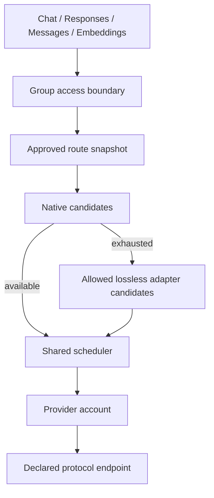
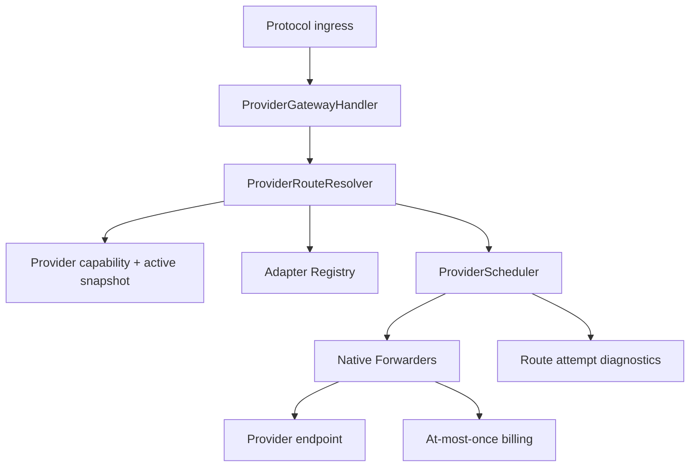

# Provider Protocol Pool - Plan

## Goal Capsule

- **Objective:** 将按平台和账号类型分叉的号池改为供应商能力驱动的通用号池，使管理员可以通过配置接入新的供应商、模型与协议接口。
- **Product authority:** Product Contract 定义最小首版行为；未列入首版的转换方向、迁移自动化、代理传输和高级调度不得被当作发布前置条件。
- **Execution profile:** 配置式最小首版；新 Provider 路由只对显式激活路由快照的 Group 生效，其他 Group 继续使用 legacy 路由。
- **Stop conditions:** 无法证明某条模型—协议组合、转换兼容性或快照身份时必须 fail closed，不得回退到 `platform/type` 推断或静默直连。
- **Open blockers:** 无产品决策阻塞；真实供应商上线仍需要管理员提供凭证并执行 capability test。

---

## Product Contract

### Summary

Provider 是一个可调度的上游接入账号，可以代表模型官方 API、NewAPI、硅基流动或其他兼容服务，不再受预设平台枚举约束。
每个 Provider 显式声明逻辑模型、原生协议、上游模型和连接能力；Group 只保留访问边界、Provider 成员关系和价格倍率，并从真实路由派生可用能力。

请求始终优先使用原生协议路径。
“允许协议转换”默认关闭；首版仅提供经过 allowlist 校验的非流式纯文本 Responses -> Chat Completions 转换，Embeddings 永不转换。

### Problem Frame

当前号池把 `platform`、账号类型、模型映射、协议转发和平台专用调度揉在一起。
新增供应商或让 Chat 请求直接访问 Chat 上游时，需要进入既有平台分支，导致 Kimi、GLM、DeepSeek 等模型即使由 NewAPI 或硅基流动提供标准接口，也无法只通过配置接入。

### Actors

- A1. **管理员：** 配置 Provider、凭证、协议端点、逻辑模型能力、Group 成员关系和转换权限。
- A2. **API 用户：** 通过 API Key 所属 Group 调用 Chat Completions、Responses、Anthropic Messages 或 Embeddings。
- A3. **上游 Provider：** 按已声明协议接收请求并返回响应、流事件、错误和 usage。

### Key Decisions

- **Provider 即上游账号。** `(session-settled: user-directed — chosen over a platform-constrained vendor type: Provider 可以是官方 API 账号或任意兼容上游账号。)` Governs R1-R4.
- **Group 不再按平台或账号类型分组。** `(session-settled: user-directed — chosen over platform/type grouping: Group 只承担访问边界、成员关系和价格倍率。)` Governs R5-R6.
- **Adapter 是协议防腐层与转换层，不负责调度。** `(session-settled: user-directed — chosen over adapter-owned routing: 调度只消费已验证的 RouteCandidate。)` Governs R10-R13.
- **原生路径优先。** `(session-settled: user-directed — chosen over price-first cross-protocol scheduling: 当前调度先耗尽原生层，再考虑转换层。)` Governs R14-R16.
- **允许协议转换默认关闭。** `(session-settled: user-directed — chosen over an opt-out conversion switch: 未显式放行的协议不匹配路径必须被排除。)` Governs R9-R12.
- **首版保持最小。** `(session-settled: user-approved — chosen over complete protocol graph and automatic migration: 首版交付可配置原生路由与一个严格转换子集，其余能力后续迭代。)` Governs R10-R22.

### Requirements

**Provider、模型与 Group**

- R1. Provider 必须是一个不受厂商品牌、平台枚举或账号类型限制的可调度上游账号，并继续复用现有账号 ID、调度状态和历史计费关联。
- R2. Provider 必须保存默认连接与加密凭证，并允许每个协议覆盖 Base URL、Path、Headers、Auth Type 和 Wire Profile。
- R3. 每项能力必须显式绑定逻辑模型、原生协议、上游模型、Feature Profile 和协议端点；未声明组合不得参与路由。
- R4. 管理员必须能够创建、编辑、测试、激活和停用 Provider；新 Provider 默认处于 draft，且“允许协议转换”默认关闭。
- R5. Group 必须继续承担 API Key 访问边界、Provider 成员关系和价格倍率，不得用 Group `platform` 决定新路由资格。
- R6. Group 的可用模型—协议组合必须从组内 Provider 的真实能力派生，不得对独立模型列表和协议列表做笛卡尔积。

**协议与 Adapter**

- R7. 用户入口必须支持 OpenAI Chat Completions、OpenAI Responses、Anthropic Messages 和 OpenAI Embeddings。
- R8. 四个协议必须支持原生上游路径；Chat 请求在 Provider 声明 Chat 能力时必须直接访问 Chat 上游。
- R9. Provider 的“允许协议转换”关闭时，所有入口协议与上游协议不一致的路径必须在调度前被排除。
- R10. 首版唯一跨协议 Adapter 为非流式纯文本 Responses -> Chat Completions，并且只接受显式 `store:false`、无续链、无工具、无流式及 allowlist 内字段。
- R11. Adapter 对未知字段或不可完整表达的语义必须 fail closed；不得静默丢字段、近似转换或产生隐藏的托管状态。
- R12. Embeddings 只能路由到原生 Embeddings 能力，且必须校验响应 JSON、向量和 usage。
- R13. Adapter 不得选择 Provider、修改调度优先级或决定计费；其输出只是带版本身份的合格 RouteCandidate。

**资格、调度与稳定性**

- R14. 路由必须先尝试原生层，只有原生层没有合格候选时才进入转换层；两个层级内部复用同一调度器。
- R15. 资格过滤至少覆盖 Provider 状态、账号可调度状态、端点与能力启停、逻辑模型状态、Feature Profile、Group、快照版本和代理支持状态。
- R16. 调度必须保留优先级、并发、负载、Sticky、请求内候选排除与故障转移；Sticky 候选满载时必须继续尝试备用候选。
- R17. Responses 续链必须绑定原 User、API Key、Group、逻辑模型和 RouteIdentity；绑定路由不可用时不得跨 Provider 或协议漂移。
- R18. 新路由只对已批准并激活快照的 Group 生效；快照必须保存完整 RouteIdentity，激活时重新校验配置漂移，并支持 previous version 回滚。
- R19. 未激活快照的 Group 必须继续使用 legacy 路由，不得由新 Provider 路由静默接管。

**安全、usage 与诊断**

- R20. Provider 凭证必须使用现有 SecretEncryptor 加密存储，管理 API 和 legacy Account DTO 不得返回凭证明文。
- R21. Provider 连接必须校验目标 URL/IP 和请求头；当前不支持的代理路由必须 fail closed，不得绕过代理直接连接。
- R22. 成功请求只有在获得完整 usage 后才能形成最终账单；同一请求只能成功计费一次，并记录逻辑模型、入口协议、上游协议、RouteIdentity、转换标志和缓存 token 类别。
- R23. 每次候选尝试必须记录独立诊断，包括 Provider、协议、层级、结果、失败类别、上游 Request ID、提交字节和结束原因；诊断不得触发计费。
- R24. 客户端在流式请求中断开后，系统必须继续读取上游以获取 usage；只有上游正常 EOF 才允许完成计费，上游中断不得按成功计费。

### Key Flows

- F1. **配置并上线 Provider**
  - **Trigger:** A1 接入官方 API、NewAPI、硅基流动或其他兼容服务。
  - **Steps:** 创建 draft Provider，配置协议端点和模型能力，执行 capability test，激活 Provider，将其加入 Group，生成并批准路由快照后激活。
  - **Outcome:** 该 Group 获得显式批准的新路由，其他 Group 不受影响。
  - **Covers:** R1-R8, R18-R21.
- F2. **原生请求**
  - **Trigger:** 入口模型和协议存在快照内原生能力。
  - **Steps:** Resolver 过滤资格，Scheduler 选择候选，Forwarder 以同协议请求上游，成功后验证 usage 并计费。
  - **Outcome:** Chat、Responses、Messages 或 Embeddings 通过原生路径完成。
  - **Covers:** R7-R8, R12, R14-R16, R22-R24.
- F3. **Responses 转 Chat**
  - **Trigger:** 没有原生 Responses 候选，Provider 允许转换，且请求满足 R10。
  - **Steps:** Adapter 先检查兼容性，再转换为 Chat 请求；Chat 响应转换回 Responses 后完成 usage 与计费。
  - **Outcome:** 支持 Responses 的最小文本子集；不兼容请求在转发前被拒绝。
  - **Covers:** R9-R14, R22-R23.
- F4. **故障转移与续链**
  - **Trigger:** 候选在不可撤销输出前失败，或 Responses 请求携带 `previous_response_id`。
  - **Steps:** 普通请求排除失败候选并在当前层继续；续链请求只允许命中原 RouteIdentity。
  - **Outcome:** 普通请求可安全 failover，续链请求不发生租户或路由漂移。
  - **Covers:** R14-R17, R23.

### Acceptance Examples

- AE1. **NewAPI / 硅基流动原生 Chat 与 Messages**
  - **Given:** Provider 为 Kimi、GLM 或 DeepSeek 声明 Chat Completions 与 Anthropic Messages 原生能力。
  - **When:** Group 快照批准并激活后，用户调用对应入口。
  - **Then:** 请求直接访问声明的原生上游端点，不经过 Responses Adapter。
- AE2. **Responses 默认不转换**
  - **Given:** 某模型只有 Chat 能力，Provider 未开启“允许协议转换”。
  - **When:** 用户调用 `/v1/responses`。
  - **Then:** 该 Provider 不进入候选，系统返回没有兼容路径。
- AE3. **Responses 最小文本转换**
  - **Given:** Provider 开启转换，请求为非流式纯文本、显式 `store:false`，且不含工具和续链。
  - **When:** 没有原生 Responses 候选。
  - **Then:** 系统使用版本化 Responses -> Chat Adapter，并返回 Responses 结构。
- AE4. **不兼容转换 fail closed**
  - **Given:** Responses 请求包含 `previous_response_id`、工具、流式或未知字段。
  - **When:** Resolver 检查转换资格。
  - **Then:** 转换路径在请求上游前被排除。
- AE5. **Embedding 永不转换**
  - **Given:** Group 内只有对话协议能力。
  - **When:** 用户调用 `/v1/embeddings`。
  - **Then:** 系统返回无原生 Embeddings 路径，不调用对话 Adapter。
- AE6. **快照配置漂移**
  - **Given:** 快照批准后，Provider 能力版本或 RouteIdentity 已改变。
  - **When:** 管理员尝试激活旧快照。
  - **Then:** 激活失败且 Group 指针不移动。
- AE7. **流式断开仍恰好一次计费**
  - **Given:** 客户端写入失败，但上游继续并正常 EOF，最终 usage 完整。
  - **When:** Handler 完成 drain。
  - **Then:** 系统只记录一次成功账单；若上游非 EOF 中断则不完成成功账单。
- AE8. **未切换 Group 保持 legacy**
  - **Given:** Group 没有 active route snapshot。
  - **When:** 用户调用任一既有入口。
  - **Then:** 请求继续走原有 dispatcher。

### Success Criteria

- 管理员无需新增平台枚举或网关分支，即可配置 NewAPI、硅基流动及官方 API Provider。
- Chat、Responses、Messages 和 Embeddings 都存在可验证的原生转发路径。
- Responses -> Chat 的允许、默认拒绝和不兼容拒绝都有回归测试。
- 调度、快照、续链、usage、计费、客户端断开和凭证脱敏都有自动化验证。
- legacy Group 在未显式切换前保持原行为。

### Scope Boundaries

**Included in the minimum release**

- Provider Profile、逻辑模型、协议端点、模型—协议能力矩阵、Group 成员关系和价格倍率。
- 四协议原生入口与原生上游转发。
- 非流式纯文本 Responses -> Chat Completions 转换。
- 原生优先调度、Sticky、故障转移、Responses 续链绑定、快照审批/激活/回滚。
- Provider 管理 UI/API、capability test、路由尝试诊断、完整 usage 才结算及一次计费。
- 新 Provider 路由与 legacy dispatcher 按 Group 快照显式切换。

**Deferred for later**

- 流式转换、工具调用转换，以及 Chat、Messages、Responses 的其他转换方向。
- 自动回填旧账号能力、自动开启旧转换权限、legacy compatibility route 和真实旧/新流量 shadow compare。
- 全量通用 Provider 监控与告警、`provider_route_attempts` 保留清理策略。
- destination-pinned 代理传输；首版遇到已配置代理的 Provider 路由 fail closed。
- Provider 全聚合事务化更新；首版更新进入 draft 并在失败时保持不可调度，管理员修正后重试。
- 独立 Provider 密钥版本轮换；首版复用现有 SecretEncryptor。
- Provider HTTP Transport 连接复用和按路由预加载优化。
- 成本、延迟、质量、区域、自定义权重等高级调度；首版固定原生优先。

**Explicitly excluded**

- 有损协议转换和 Embeddings 与对话协议之间的转换。
- 用 `groups.platform`、`accounts.platform` 或账号类型决定新 Provider 路由资格。
- 未经快照批准的自动切流。

### Dependencies and Assumptions

- Provider 声明某协议意味着其上游兼容对应协议及所选 Wire Profile；capability test 是启用前的最低验证。
- NewAPI 与硅基流动的具体模型名和端点可能随部署变化，因此以管理配置为事实来源，不硬编码厂商枚举。
- 上游成功响应必须提供完整 usage；Chat 流式上游由系统请求 usage，并在客户端未主动请求时隐藏额外 usage-only 事件。
- 旧平台专用 OAuth、Cookie、隐私、图片和配额能力继续走 legacy 路径，不纳入本计划。

---

## Planning Contract

### Key Technical Decisions

- KTD1. **ProviderProfile 一对一扩展 Account。** Provider ID 继续使用 `accounts.id`，从而复用并发、优先级、冷却、代理、Group 关系及 `usage_logs.account_id`。
- KTD2. **ProtocolFamily 为闭合值对象。** 首版固定 `chat_completions`、`responses`、`anthropic_messages`、`embeddings`；Endpoint、WireProfile 与 FeatureProfile 显式建模。
- KTD3. **RouteIdentity 是快照和续链的稳定身份。** 身份包含 Provider、Capability、Endpoint、入口协议、上游协议和 Adapter 版本；运行时只使用 active snapshot 内的身份。
- KTD4. **Resolver 生成分层候选，Scheduler 只排序和选择。** Resolver 完成能力、协议、Feature Profile、快照、转换开关和 Adapter 兼容性过滤；Scheduler 不读取平台枚举。
- KTD5. **Adapter Registry 采用正向 allowlist。** 首版只注册 `responses_to_chat_completions@v1/non_stream_text_v1`，未知字段与不支持能力直接不合格。
- KTD6. **Forwarder 按原生协议分派。** 公共层处理安全目标解析、鉴权、模型替换、响应大小、SSE 与 usage 观察；Embeddings 额外验证向量结构。
- KTD7. **账单与 route attempt 分离。** Attempt 可记录失败、拒绝或成功路径；只有完整 usage 进入幂等成功账单，客户端断开不取消后台 drain。
- KTD8. **Group 快照是显式切换边界。** Manifest 保存完整 RouteIdentity；批准后激活，激活事务内重新校验，回滚只交换 active/previous 指针并失效认证缓存。
- KTD9. **安全能力未完成时 fail closed。** 凭证加密、目标/IP/Headers 校验必须生效；代理传输未实现时不允许静默直连。

### High-Level Technical Design

### Risks and Mitigations

- **Capability overstatement:** 所有组合显式建模，快照保存 RouteIdentity，激活前重新验证。
- **跨协议语义损失:** Registry 只允许最小文本子集，其他请求在转发前拒绝。
- **流式漏计费:** Chat 上游请求 usage，客户端断开后继续 drain；非 EOF 中断不成功计费。
- **凭证或 SSRF 泄露:** 凭证加密且 DTO 脱敏，目标解析和请求头策略 fail closed。
- **迁移影响既有流量:** 只有 active snapshot 的 Group 进入新路由，其余 Group 保持 legacy。

---

## Implementation Units

### U1. Provider 领域与持久化

- **Goal:** 建立 ProviderProfile、ProtocolEndpoint、LogicalModel、ModelCapability、RouteSnapshot、MigrationReview、RouteAttempt 与 usage route 字段。
- **Files:** `backend/ent/schema/`, `backend/migrations/136_provider_protocol_pool.sql`, `backend/migrations/137_provider_usage_route_index_notx.sql`, 生成的 `backend/ent/` 文件。
- **Verification:** Schema 生成成功；迁移测试确认事务迁移与并发索引拆分。
- **Covers:** R1-R6, R18, R20, R22-R23.

### U2. Provider 管理与安全配置

- **Goal:** 提供 Provider CRUD、版本冲突、测试、激活/停用、能力矩阵、加密凭证与管理 UI。
- **Files:** `backend/internal/service/provider_service.go`, `backend/internal/handler/admin/provider_handler.go`, `backend/internal/handler/dto/provider.go`, `frontend/src/views/admin/ProvidersView.vue`, `frontend/src/components/provider/`.
- **Verification:** DTO snake_case、凭证脱敏、默认转换关闭、draft/active 生命周期和 capability test 测试。
- **Covers:** R2-R4, R20-R21.

### U3. Resolver、Scheduler 与快照切换

- **Goal:** 生成原生/转换候选，执行通用调度，并用 active snapshot 限制实际路由和续链。
- **Files:** `backend/internal/service/provider_route_resolver.go`, `backend/internal/service/provider_scheduler.go`, `backend/internal/repository/provider_repo.go`, `backend/internal/service/api_key_auth_cache*`.
- **Verification:** 原生优先、Feature Profile、Sticky 满载备用、续链租户绑定、未批准快照拒绝、漂移拒绝和回滚测试。
- **Covers:** R5-R6, R14-R19.

### U4. 四协议原生 Forwarder

- **Goal:** 让 Chat、Responses、Messages 和 Embeddings 直接请求声明的原生端点，并保持协议语义。
- **Files:** `backend/internal/service/provider_forwarder.go`, `backend/internal/repository/http_upstream.go`, `backend/internal/handler/provider_gateway_handler.go`, `backend/internal/server/routes/gateway.go`.
- **Verification:** 原生请求/响应、SSE、目标安全、错误、响应大小、Embedding 向量与 usage 测试。
- **Covers:** R7-R8, R12, R21, R24.

### U5. 最小 Adapter

- **Goal:** 实现严格的非流式纯文本 Responses -> Chat 请求与响应转换。
- **Files:** `backend/internal/pkg/apicompat/`, `backend/internal/service/provider_gateway_service.go`.
- **Verification:** `store:false`、未知字段、续链、工具、流式拒绝，以及响应/usage 映射测试。
- **Covers:** R9-R13.

### U6. Usage、计费与诊断

- **Goal:** 记录 RouteIdentity、协议、转换、缓存 token 与 attempt，并保持一次计费。
- **Files:** `backend/internal/service/provider_usage_billing.go`, `backend/internal/repository/usage_log_repo.go`, `backend/internal/repository/provider_route_attempt_repo.go`.
- **Verification:** 缓存 token 计价、缺失 usage 拒绝最终账单、客户端断开、上游中断及幂等测试。
- **Covers:** R22-R24.

---

## Verification Contract

| Scope | Command | Done signal |
|---|---|---|
| Migrations | `cd backend && go test ./migrations -count=1` | Provider migrations and concurrent-index split pass |
| Services | `cd backend && go test ./internal/service -count=1` | Resolver, scheduler, forwarder, snapshots, usage and billing pass |
| Repositories | `cd backend && go test ./internal/repository -count=1` | Provider, cache, snapshot and usage persistence pass |
| Handlers | `cd backend && go test ./internal/handler ./internal/handler/admin ./internal/handler/dto -count=1` | Gateway/admin contracts and DTOs pass |
| Adapters | `cd backend && go test ./internal/pkg/apicompat -count=1` | Responses -> Chat allowlist contract passes |
| Generated code | `cd backend && make generate` | Wire/Ent generated code is current |
| Frontend | `cd frontend && pnpm run test:run && pnpm run typecheck` | Provider UI tests and TypeScript pass |
| Build | `make build` | Backend and frontend production build succeeds |
| Diff hygiene | `git diff --check` | No whitespace errors |

### Required Acceptance Matrix

| Case | Native | Conversion | Expected |
|---|---:|---:|---|
| Chat -> Chat | yes | no | Direct Chat upstream |
| Responses -> Responses | yes | no | Direct Responses upstream |
| Messages -> Messages | yes | no | Direct Messages upstream |
| Embeddings -> Embeddings | yes | no | Direct Embeddings upstream with vector/usage validation |
| Responses -> Chat, conversion off | no | no | No eligible route |
| Responses -> Chat, compatible text | no | yes | Adapter v1 path succeeds |
| Responses -> Chat, stream/tools/state/unknown field | no | no | Rejected before upstream |
| Embeddings -> conversational protocol | no | no | Never converted |
| Active snapshot identity drift | n/a | n/a | Activation rejected; Group pointer unchanged |
| Client stream disconnect + upstream EOF | n/a | n/a | Drain completes and exactly one bill is finalized |
| Upstream stream interruption | n/a | n/a | No successful bill |

---

## Definition of Done

### Global completion criteria

- R1-R24 and AE1-AE8 are covered by implementation or explicit fail-closed behavior.
- NewAPI、硅基流动及官方 API 不需要新增平台枚举即可配置协议端点和模型能力。
- 四协议原生路径、Responses -> Chat 最小转换、快照切换、续链绑定和 usage/计费均有自动化测试。
- “允许协议转换”默认关闭，Embeddings 不转换，代理不静默绕过，凭证不通过 API 泄露。
- 未激活新快照的 Group 保持 legacy dispatcher。
- Verification Contract 中适用命令全部通过，生成代码和迁移文件已纳入 Git。
- Deferred 项不作为首版完成条件，也不得被文档或 UI 宣称为已支持。

### Unit completion criteria

- U1-U6 的代码、测试和迁移均存在且通过对应验证。
- 路由热路径只使用 active snapshot 内完整 RouteIdentity。
- 缺失或不完整 usage 不得形成零成本最终账单。
- 客户端断开且上游正常完成时仍只计费一次；上游中断不按成功计费。
- Provider 管理页面可以配置 Chat、Responses、Messages、Embeddings 能力与转换开关，并清楚展示 Group 派生路由。

---

## Appendix

### Repository Evidence

- `backend/internal/server/routes/gateway.go` — 四协议入口和 Provider/legacy 分流。
- `backend/internal/service/provider_route_resolver.go` — 原生优先与 Adapter 资格。
- `backend/internal/service/provider_forwarder.go` — 原生协议转发、安全目标、SSE 和 usage。
- `backend/internal/service/provider_service.go` — Provider 管理、能力测试和路由快照。
- `backend/internal/service/provider_usage_billing.go` — Provider usage 与一次计费。
- `frontend/src/views/admin/ProvidersView.vue` — Provider 管理入口。
