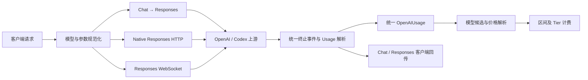

# GPT-5.6 端到端上游对齐移植设计

## 1. 背景

当前仓库已具备 GPT-5.6 Sol、Terra、Luna 的基础支持，包括：

- 模型映射和部分别名。
- standard、priority、flex 定价。
- cache read/write 计费。
- 272K 长上下文倍率。
- `reasoning.effort:"max"`。
- HTTP、compact、WebSocket 的部分 usage 解析。
- 三个模型的定价元数据。

但与已获取的 `upstream/main@7d239d62e` 对比后，仍存在模型识别、区间计价、Chat→Responses 转换、OAuth Responses、WebSocket 和终止 usage 回传差异。

其中部分差异会导致：

- GPT-5.6 请求被上游以 400 拒绝。
- 结构化输出或工具参数被静默丢弃。
- WebSocket 和兼容上游的 usage 漏记。
- 模型别名无法命中价格，最终产生零费用记录。
- `service_tier` 实际请求值与计费值不一致。

本设计只移植与 GPT-5.6 正确性直接相关的语义，不做 OpenAI 全链路无差别同步。

## 2. 上游基线

当前审计基线：

```text
upstream/main@7d239d62e
2026-07-13T17:37:00+08:00
```

此前刷新远端时 GitHub 网络不可达，因此实施开始前必须重新执行：

```bash
git fetch upstream main --prune
```

处理规则：

1. 若 `upstream/main` 仍为 `7d239d62e`，直接按本设计实施。
2. 若引用发生变化，只重新审计本设计列出的目标文件和逻辑。
3. 若发现新的 GPT-5.6 行为差异，先更新设计，不在实施阶段临时扩展范围。
4. 自动化测试不得依赖实时网络或动态上游代码。

## 3. 目标

完成后应保证：

- GPT-5.6 合法别名稳定归一化到 Sol、Terra 或 Luna。
- 未知别名不会误命中某个 GPT-5.6 价格。
- cache write token 参与区间价格选档。
- Chat API 的 GPT-5.6 参数能正确转换为 Responses API 参数。
- OAuth Responses reasoning 请求包含加密推理内容。
- Chat、Responses HTTP、Responses WS 对 `service_tier` 使用一致规则。
- HTTP、Chat bridge、WS 均能从所有合法终止事件中提取 usage。
- Chat 客户端能够收到 reasoning token details。
- 已对齐的价格、cache write 和 `max` effort 行为不回退。

## 4. 非目标

本次不移植：

- APIKey Chat 上游能力探测和自动直连 Chat 路由。
- 完整 OpenAI fast policy 后台配置、规则匹配、filter/block 管理框架。
- GPT-5.6 对应的完整 Codex base prompt。
- `client_metadata["x-codex-installation-id"]` 注入。
- 非 WebSocket 路径统一删除 `previous_response_id`。
- audio token 和 predicted-output token 的完整透传。
- `content_filter` 等非 GPT-5.6 核心兼容增强。
- OpenAI 文件拆分、日志重构、热路径优化等纯结构变化。
- Claude、Gemini、Grok、图片生成等无关上游变化。

## 5. 总体架构

采用语义移植，不整文件覆盖、不直接 cherry-pick 大型上游提交。



逻辑分为四层：

1. 模型与协议公共层：负责 GPT-5.6 canonical model、reasoning model、`service_tier` 和终止 usage 解析。
2. 请求适配层：分别处理 Chat、Native Responses 和 WebSocket，但复用公共规范化函数。
3. usage 与计费层：所有协议最终汇入统一 `OpenAIUsage` 和 `UsageTokens`。
4. 测试层：按职责拆分测试，不依赖一个大型集成用例覆盖全部行为。

## 6. 模型别名与价格候选

### 6.1 Canonical model 规则

扩展并收敛现有 GPT-5.6 alias 逻辑。

应支持：

```text
gpt-5.6
gpt5.6
openai/gpt-5.6
gpt-5.6-max
gpt-5.6-high
gpt-5.6-2026-07-09
gpt-5.6-sol
gpt-5.6-sol-2026-07-09
gpt-5.6-terra-high
gpt-5.6-luna-preview
```

映射规则：

- 裸 `gpt-5.6` → `gpt-5.6-sol`。
- 日期后缀裸模型 → `gpt-5.6-sol`。
- `none/minimal/low/medium/high/xhigh/max` → `gpt-5.6-sol`。
- `sol-*` → `gpt-5.6-sol`。
- `terra-*` → `gpt-5.6-terra`。
- `luna-*` → `gpt-5.6-luna`。
- provider prefix 只取最后一个模型段。
- 大小写、空格、下划线和连续横线进行统一处理。

不得接受：

```text
gpt-5.6-extra-high
gpt-5.6-foo
gpt-5.6-terra-foo
openai/gpt-5.6-unknown
```

`extra-high` 可以作为某些 reasoning effort 的兼容拼写处理，但不能被当作 GPT-5.6 模型别名。

### 6.2 价格候选顺序

不能过早把所有模型名替换为 canonical model，否则可能破坏渠道显式价格和原始模型优先级。

计费候选必须按以下顺序去重：

1. 明确指定的 billing model。
2. 渠道映射后的模型。
3. 客户端原始模型。
4. 上游实际模型。
5. canonical GPT-5.6 model。

这样既保留用户或渠道的精确价格，又保证合法别名最终可以命中官方 GPT-5.6 价格。

### 6.3 定价缺失行为

保持现有“价格不可用时记录零费用”的最后兜底语义，避免本次迁移改变请求成功状态。

但必须新增结构化警告日志，包含：

- 原始模型。
- 映射模型。
- 上游模型。
- canonical model。
- 完整价格候选列表。
- 账号、API Key 和渠道信息。

目标是消除“静默零费用”，而不是在本次迁移中改变账单失败策略。

## 7. 计费区间选择

当前区间价格使用：

```go
InputTokens + CacheReadTokens
```

应改为：

```go
InputTokens + CacheCreationTokens + CacheReadTokens
```

三类输入 token 必须共同参与区间选择，因为它们都占用当前请求的输入上下文。

确定区间价格后，费用仍按互斥 token 桶计算：

- 普通输入 token。
- cache creation/write token。
- cache read token。
- 输出 token。

不得把 cache write 同时按普通输入和 cache write 重复收费。

无区间价格时，继续使用现有 GPT-5.6 长上下文策略：

```text
总输入上下文 > 272000
输入侧价格 × 2
输出侧价格 × 1.5
```

阈值保持严格大于，不改为大于等于。

## 8. Chat → Responses 请求转换

### 8.1 Sampling 参数

GPT-5.x reasoning models 不发送 `temperature` 和 `top_p`。模型判断必须基于客户端原始模型和最终映射模型，避免自定义别名绕过判断。非 reasoning model 保持现有透传行为。

### 8.2 结构化输出

Chat：

```json
{"response_format":{"type":"json_object"}}
```

转换为：

```json
{"text":{"format":{"type":"json_object"}}}
```

`json_schema` 需要把 Chat 外层的 `json_schema` 对象展开为 Responses `text.format`，不得丢失 schema、name、description 和 strict。其他合法 JSON 形态按规范化后的原始值写入 `text.format`；输入不是合法 JSON 时返回明确的请求转换错误，不允许静默丢弃。

### 8.3 并行工具调用

`parallel_tool_calls` 使用 `*bool` 表达：

- 未提供：省略。
- `true`：显式传递。
- `false`：也必须显式传递。

不能使用普通 bool，否则无法区分未提供和显式 false。

### 8.4 Tool 与 tool choice

legacy Chat：

```json
{"function_call":{"name":"search"}}
```

转换为：

```json
{"tool_choice":{"type":"function","name":"search"}}
```

不再生成嵌套的 `tool_choice.function.name`。function tool 未提供 `strict` 时，Responses 请求显式序列化 `strict:false`；客户端显式提供 true 或 false 时保持原值。

### 8.5 空内容

以下内容都不能生成 `content:null`：

- `content:null`。
- 空 content array。
- 只有空文本的数组。
- 只有被过滤的空图片。
- 没有支持类型的 content parts。

无有效 part 时回退为 `content:""`。

### 8.6 Reasoning history

Chat assistant 消息存在 `reasoning_content` 时，将其保留为 thinking 标记内容，再与 assistant 正文组合：

```text
<thinking>reasoning_content</thinking>
assistant content
```

该行为只用于历史输入兼容，不把新的加密 reasoning 内容暴露给 Chat 客户端。

### 8.7 Prompt cache key

APIKey Chat bridge 如果已从请求或会话中提取到 `prompt_cache_key`，应写入 Responses body。OAuth 路径保持现有自动派生和 session header 行为。

### 8.8 OAuth Chat instructions

Chat bridge 的 OAuth transform 不应在无 system/developer message 时注入 `You are a helpful coding assistant.`。

规则：

- Chat 中存在 system/developer 内容：转换为 instructions。
- Chat 显式提供 instructions：保留。
- 两者均不存在：保证字段形状满足上游，但值保持为空。
- Native Responses 继续保留当前默认 instructions 行为，本次不引入完整模型 base prompt。

## 9. Service Tier

### 9.1 公共规范化

统一函数接受：

```text
fast      → priority
priority  → priority
flex      → flex
auto      → auto
default   → default
scale     → scale
```

空值和未知值返回无 tier。

### 9.2 请求侧行为

- Chat bridge：转换后立即规范化。
- Native Responses：模型映射后规范化。
- WebSocket：每个 `response.create` 独立规范化。
- 未知 tier：从上游 payload 删除，避免 400。
- 本次不引入完整 fast policy filter/block 管理框架。

### 9.3 计费行为

- `priority` 使用 priority 价格。
- `flex` 优先使用已解析的 flex 专属价格；没有专属价格时使用现有 `0.5` tier 倍率。
- `auto/default/scale` 按标准价格计费，并保留规范化 tier 用于使用记录。
- `fast` 必须先变为 `priority`，不能请求时发送 fast、计费时单独解释成 priority。
- usage 记录保存规范化后的最终 tier。

## 10. Native Responses OAuth

### 10.1 Unsupported 字段

OAuth ChatGPT internal Codex endpoint 转发前删除：

```text
max_output_tokens
max_completion_tokens
temperature
top_p
frequency_penalty
presence_penalty
user
metadata
prompt_cache_retention
safety_identifier
stream_options
```

该清理只作用于 OAuth internal endpoint。APIKey 或自定义 OpenAI-compatible 上游不应无条件复用该列表。

### 10.2 Encrypted reasoning include

非 compact 请求存在非空 reasoning 时，确保：

```json
{"include":["reasoning.encrypted_content"]}
```

行为必须满足：

- include 缺失：创建数组。
- 已包含目标值：不重复。
- include 是合法数组但不包含：追加。
- include 类型异常：不破坏原值，由上游负责校验。
- `/responses/compact` 不执行该注入。

### 10.3 Tool choice

Native Responses OAuth 同样使用平铺 function choice：

```json
{"type":"function","name":"tool_name"}
```

同时兼容修正历史嵌套形状，避免旧客户端请求继续失败。

### 10.4 已对齐行为

保持：

- GPT-5.6 普通 Responses 的 `max`。
- compact 的 `max → xhigh`。
- 模型映射后仍用 GPT-5.6 模型判断 effort。
- cache write usage 主路径。

## 11. Responses WebSocket

### 11.1 每轮请求规范化

所有第一轮和后续 `response.create` 都经过相同处理：

1. 校验 JSON。
2. 补齐或校验 event type。
3. 解析客户端模型。
4. 后续 turn 省略 model 时复用当前 session model。
5. 应用账号模型映射。
6. 写回具体上游模型。
7. 规范化 `service_tier`。
8. 提取最终 tier、reasoning effort 和 prompt cache key。
9. 转发上游。

只有第一轮和历史 session 都没有模型时，才返回缺少 model。

### 11.2 Tier 与计费

计费结果必须从规范化后的 payload 提取 tier，不能从客户端原始 frame 提取。如果未来引入完整 fast policy，应继续使用相同“最终 payload 决定计费”的规则。

### 11.3 终止事件

以下事件均视为终止事件：

```text
response.completed
response.done
response.failed
response.incomplete
response.cancelled
response.canceled
```

成功、失败或取消事件只要携带 usage，都应解析并记录真实 token。

### 11.4 Usage 位置

同时支持顶层 `usage` 和 `response.usage`。

优先级：

1. 顶层显式 usage。
2. `response.usage`。
3. 没有 usage 时保留已累计值。

不得因为顶层字段存在显式零值而回退到另一个非零 alias。

## 12. HTTP 与 Chat Usage 回传

### 12.1 统一终止事件判断

Chat bridge 和 Native Responses 共用终止事件判断，统一覆盖：

```text
response.completed
response.done
response.failed
response.incomplete
response.cancelled
response.canceled
```

### 12.2 Chat streaming

`response.done` 必须：

- 触发 finish chunk。
- 设置 stream finalized。
- 提取顶层或嵌套 usage。
- 在 `include_usage:true` 时输出 usage chunk。
- 最后输出 `[DONE]`。
- 不再被误判为异常断流后由 fallback finalize 补结束。

### 12.3 Reasoning token details

Chat usage 增加：

```json
{"completion_tokens_details":{"reasoning_tokens":32}}
```

现有本地扩展字段 `cache_creation_input_tokens` 和 `cache_write_input_tokens` 暂时保留，避免破坏已有客户端；同时继续输出官方嵌套的 `prompt_tokens_details.cached_tokens` 和 `prompt_tokens_details.cache_write_tokens`。

### 12.4 Reasoning 和工具增量

支持：

```text
response.reasoning_summary_text.delta
response.reasoning_text.delta
response.function_call_arguments.delta
response.custom_tool_call_input.delta
```

统一映射到现有 Chat reasoning 或 tool call delta。本次只移植 delta 主路径，不扩展所有 custom tool 事件类型。

## 13. Cache Write Usage 优先级

继续采用以下优先级：

1. `input_tokens_details.cache_write_tokens`。
2. `prompt_tokens_details.cache_write_tokens`。
3. `input_tokens_details.cache_creation_tokens`。
4. `prompt_tokens_details.cache_creation_tokens`。
5. 顶层兼容 alias。

嵌套字段只要存在，即使为零，也必须覆盖顶层非零 alias。顶层 alias 仅在嵌套字段完全缺失时作为兼容 fallback。负数统一钳制为零。

## 14. 错误处理

### 请求转换错误

- 无效 Chat JSON：返回参数解析错误。
- 无效 `response_format` JSON：返回明确转换错误。
- 无效 legacy function choice：返回 tool choice 转换错误。
- 空 content：修正为字符串，不作为错误。
- 未知 tier：删除字段，不发送非法值。
- 未知 GPT-5.6 alias：不回退到 Sol。

### 上游错误

- 本次不改变现有 failover 策略。
- Unsupported parameter 仍进入现有错误响应或 failover。
- `response.failed` 携带 usage 时，先保存 usage，再处理错误。
- WS 请求被本地拒绝时不得生成虚假 usage。

### 计费错误

- 合法 GPT-5.6 alias 应通过 canonical candidate 找到价格。
- 所有候选均无价格时记录结构化警告。
- 保持当前零费用最后兜底，不在本次改成请求失败。

## 15. 文件影响范围

主要允许修改的生产文件范围：

```text
backend/internal/service/openai_gpt56_alias.go
backend/internal/service/billing_service.go
backend/internal/service/pricing_service.go
backend/internal/service/openai_codex_transform.go
backend/internal/service/openai_gateway_chat_completions.go
backend/internal/service/openai_gateway_service.go
backend/internal/service/openai_ws_forwarder.go
backend/internal/service/openai_ws_v2_passthrough_adapter.go
backend/internal/service/openai_ws_v2/passthrough_relay.go
backend/internal/pkg/apicompat/types.go
backend/internal/pkg/apicompat/chatcompletions_to_responses.go
backend/internal/pkg/apicompat/responses_to_chatcompletions.go
```

对应测试文件主要包括：

```text
backend/internal/service/billing_service_test.go
backend/internal/service/pricing_service_test.go
backend/internal/service/openai_model_mapping_test.go
backend/internal/service/openai_codex_transform_test.go
backend/internal/service/openai_gateway_chat_completions_test.go
backend/internal/service/openai_gateway_service_test.go
backend/internal/service/openai_ws_forwarder_success_test.go
backend/internal/service/openai_ws_forwarder_ingress_session_test.go
backend/internal/service/openai_ws_v2/passthrough_relay_test.go
backend/internal/service/openai_ws_v2/passthrough_relay_internal_test.go
backend/internal/pkg/apicompat/chatcompletions_responses_test.go
```

实施计划可以按仓库现状缩小上述文件范围，但不得为了移植上游而复制无关测试文件；如确需增加未列出的生产文件，必须先更新本设计并说明新增边界。

## 16. 迁移顺序

### 阶段 0：固定上游基线

- 刷新 `upstream/main`。
- 记录最终 commit。
- 重新检查目标文件差异。
- 更新设计中的基线值。

### 阶段 1：公共模型和 usage 原语

- GPT-5.6 canonical alias。
- reasoning model 判断。
- service tier 规范化。
- 终止事件及 usage 位置解析。

先完成这些公共函数，避免三个协议入口分别复制逻辑。

### 阶段 2：计费正确性

- canonical 价格候选。
- 区间选档加入 cache write。
- 定价缺失日志。
- 保留现有定价和长上下文逻辑。

### 阶段 3：Chat 请求转换

- sampling 参数。
- response format。
- parallel tool calls。
- strict 和 tool choice。
- 空 content。
- reasoning history。
- prompt cache key。
- OAuth Chat instructions。

### 阶段 4：Native Responses OAuth

- unsupported 字段。
- encrypted reasoning include。
- tool choice。
- service tier。

### 阶段 5：WebSocket

- 后续 turn model 复用。
- 每轮 tier 规范化。
- 最终 tier 计费。
- 全终止事件 usage。

### 阶段 6：响应回传

- `response.done`。
- 顶层 usage。
- reasoning token details。
- reasoning/custom tool delta。

### 阶段 7：端到端验证

- 全部定向测试。
- 后端相关包测试。
- Git diff 和工作区检查。
- 与固定上游基线重新执行语义差异审计。

## 17. 测试设计

### 模型别名

- 裸模型、`gpt5.6`、provider prefix、日期、variant 和 effort 后缀。
- `extra-high` 和未知 suffix 拒绝。
- APIKey 模型不被不必要改写。

### 计费

- 合法 alias 能命中对应价格。
- Terra/Luna 不错误回退到 Sol。
- cache write 刚好跨越区间边界。
- 272K 长上下文严格大于边界。
- standard/priority/flex。
- 价格候选优先级。
- 所有候选缺失时产生零费用和明确日志。

### Chat 转换

- GPT-5.6 删除 sampling 参数，非 reasoning model 保留。
- json object 和 json schema。
- `parallel_tool_calls:true/false`。
- legacy tool choice。
- strict 缺省及显式值。
- null、空数组和空图片 content。
- reasoning history。
- APIKey prompt cache key。
- OAuth 空 instructions。

### Native Responses

- unsupported 字段只在 OAuth 删除。
- reasoning include 创建、追加、去重。
- compact 不注入 encrypted include。
- GPT-5.6 `max` 保留，compact `max → xhigh`。
- service tier 合法值和未知值。

### WebSocket

- 第一轮 GPT-5.6 模型映射和后续 frame 省略 model。
- `fast → priority` 和最终计费 tier。
- 主 ingress 和 `ws_v2` passthrough relay 的每轮 `response.create` 使用同一规范化规则。
- completed、done、failed、incomplete、cancelled usage。
- 顶层和嵌套 usage。
- cache write 显式零值。

### 响应转换

- 非流式和 streaming reasoning tokens。
- `response.done` 正常结束。
- 顶层 terminal usage。
- reasoning text delta 和 custom tool delta。
- 原有 cache write 扩展字段保持兼容。

## 18. 验收标准

- 合法 GPT-5.6 alias 均能稳定映射并获得正确价格。
- 未知 alias 不会误命中 GPT-5.6 fallback。
- 区间选档包含所有输入 token 桶。
- GPT-5.6 Chat 请求不再携带非法 sampling 参数。
- Chat 结构化输出和并行工具设置不再丢失。
- OAuth reasoning 请求包含 encrypted content include。
- Chat、Responses、WS 的 tier 规范化规则一致。
- 请求发送值、usage 记录值和计费 tier 一致。
- HTTP、Chat、WS 的全部终止事件都能提取 usage。
- Chat 能回传 reasoning token details。
- 已对齐价格、cache write、long context 和 `max` effort 测试继续通过。
- 不引入完整 fast policy、APIKey Chat 路由探测或其他非目标能力。
- 工作区无无关改动。
- 设计中列出的定向测试和相关后端测试全部通过。

## 19. 风险与缓解

### 上游文件已重构

按函数语义移植，不按文件位置复制；固定最终上游 commit。

### Canonical model 破坏渠道价格优先级

canonical model 仅追加为价格候选，不覆盖原始和渠道映射模型。

### Service tier 改变现有计费

只对 `fast` 做明确映射；`auto/default/scale` 仍按标准价格计算。

### 移除 OAuth 字段影响 APIKey 上游

unsupported 字段列表严格限定在 OAuth internal endpoint。

### Chat usage 输出字段变化

新增官方 completion details，同时保留现有 cache write 扩展字段。

### WS 后续 turn model 复用造成跨模型污染

session 只缓存已经通过第一轮校验和映射的原始模型；连接结束即释放。

### 范围扩散到完整上游同步

实施计划逐任务列出允许修改的文件和验证命令；非目标变化单独记录，不顺手移植。
