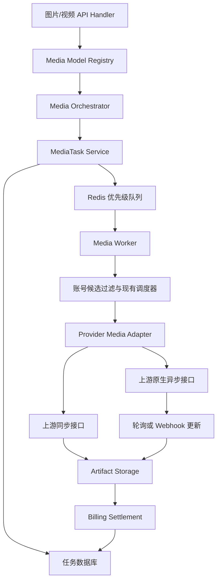

# 统一媒体生成任务架构设计

## 1. 背景

FluxCode 当前的图片生成能力主要围绕 OpenAI Images API 和 `gpt-image-*` 链路构建。公共入口、请求解析、账号调度、上游转发、响应转换、图片缓存、结果存储和计费大量集中在 `OpenAIGateway.Images` 相关文件中。

这套结构能够承载现有 OpenAI 图片模型，但继续接入以下模型系列时会产生明显扩展压力：

- 图片：Nano Banana、Z-Image、Grok Imagine，以及后续其他文生图、图生图和图片编辑模型。
- 视频：Grok、Veo、Seedance、Agens Video，以及后续其他文生视频、图生视频、续写和 Remix 模型。

这些供应商在协议、账号认证、请求参数、同步方式、异步任务、结果下载和计费维度上并不一致。继续在现有图片 Handler 和 Service 中增加平台判断，会让同步与异步、图片与视频、供应商协议和账单逻辑相互缠绕。

本设计建立独立的媒体生成域。它保留现有 OpenAI 兼容入口和账号调度优势，同时引入统一任务内核、模型能力注册、媒体 Adapter、可靠队列、结果存储和账单结算。

## 2. 参考基线

设计期间只读审计了以下代码：

```text
FluxCode HEAD@2b7a43dba
upstream/main@da85cc7e4
new-api main@a63364d1
```

参考内容包括：

- FluxCode 现有 OpenAI 图片生成、账号池、调度、账单和图片存储能力。
- 上游仓库 Grok 图片、视频及批量图片任务的实现边界。
- `new-api` 的通用 Task、视频提交与查询、任务轮询、预扣费、差额结算、失败退款和视频内容代理。

本设计只吸收语义和架构经验，不合并上游分支，不整文件覆盖，也不直接复制 `new-api` 的实体与路由结构。

## 3. 目标

完成总体架构后应满足：

- 图片和视频具有统一、可恢复的任务执行底座。
- 下游通过同一创建接口的 `async=true` 选择异步调用；未传或 `false` 保持同步调用。
- 所有媒体模型都能向下游提供同步和异步两种调用方式，不受上游原生执行方式限制。
- 上游原生异步能力可在账号级配置，并允许模型级覆盖。
- 同一分组可以为媒体请求绑定多个平台账号，相同模型可跨账号和平台复用现有调度策略。
- OpenAI、Anthropic、Gemini 等现有文本链路不因媒体改造而重构。
- 后续新增同协议模型主要通过模型配置、账号映射和定价完成；新增协议通过独立 Media Adapter 完成。
- 同步超时、异步延续、退款和惩罚扣费具有明确且可视化的系统策略。
- 视频结果可以稳定下载，不向下游暴露上游凭证、真实任务 ID或不安全 URL。

## 4. 非目标

本设计不包含：

- 全量合并 `upstream/main`。
- 重构 OpenAI Chat/Responses、Anthropic Messages 或 Gemini 文本协议。
- 本阶段直接接入所有 Nano Banana、Z-Image、Seedance、Veo 和 Agens Video 模型。
- 本阶段移植 Grok OAuth、SSO、文本模型、额度探测、账号监控和渠道监控。
- 用户或管理员主动取消媒体任务。
- 创建新的“供应商”数据库实体。
- 把 Worker 并发、租约和轮询间隔等高风险运行参数放入运行时系统设置页。

## 5. 设计原则

### 5.1 外部按媒体分离，内部统一任务

图片和视频使用各自清晰的公共 API；任务状态、队列、Worker、恢复、存储和计费共用一个媒体任务内核。

### 5.2 模型、协议、账号分离

- 模型表示下游请求的统一模型 ID。
- Adapter 表示供应商协议和请求转换方式。
- Account 表示具体凭证、Base URL、代理、并发、优先级和模型映射。
- 调度器最终选择的单位仍是现有 Account。

### 5.3 DB 是事实源，Redis 是执行加速层

任务最终状态只以数据库为准。Redis 用于优先级队列、完成通知和分布式协调；Redis 消息重复或丢失不能导致任务永久丢失或重复结算。

### 5.4 同步和异步共用执行语义

同步请求不是另一套供应商转发逻辑，而是创建任务后等待其终态。异步请求创建相同任务后立即返回。

## 6. 总体架构



### 6.1 Media API Handler

职责：

- API Key 鉴权和任务归属校验。
- JSON、Multipart 和查询参数解析。
- 把请求转换为 `ImageSpec` 或 `VideoSpec`。
- 同步等待、异步 `202`、任务查询和内容下载响应。

Handler 不执行供应商判断、账号选择、上游轮询或余额修改。

### 6.2 Media Model Registry

Registry 保存供应商无关的模型定义：

- 统一模型 ID。
- `image` 或 `video`。
- 支持的操作：`text_to_image`、`image_to_image`、`image_edit`、`text_to_video`、`image_to_video`、`reference_to_video`、`video_extend`、`video_remix`。
- 尺寸、分辨率、时长、帧率、参考图数量和输出格式约束。
- 计费单位类型。
- 启用状态。

Registry 负责验证模型和操作，不负责选择账号。模型是否能由某个账号执行，仍由分组绑定、账号模型映射和账号媒体配置共同决定。

### 6.3 Media Orchestrator

职责：

- 归一化 `ImageSpec` 或 `VideoSpec`。
- 校验模型能力和供应商无关参数。
- 执行内容审核和媒体生成权限检查。
- 生成请求指纹并处理幂等。
- 解析分组允许的账号候选。
- 创建任务、快照定价并预扣费。
- 按下游模式进入同步等待或异步返回。

### 6.4 MediaTask Service

职责：

- 创建任务并管理状态转换。
- 管理 Worker 租约、进度、重试、上游任务 ID和结果元数据。
- 提供幂等结算入口。
- 提供恢复扫描和 Redis 重新投递。

### 6.5 Media Worker

- 同步请求进入高优先级队列。
- 异步请求进入普通优先级队列。
- Worker 持有任务执行上下文，Handler 只等待任务通知。
- 同步超时转异步时不重新提交任务。
- 队列采用至少一次投递，重复消息由任务状态和 CAS 拦截。

### 6.6 Provider Media Adapter

Adapter 只作用于媒体生成域，不重构文本协议。能力按小接口拆分：

- 同步生成。
- 原生异步提交。
- 异步状态查询。
- 结果解析与下载。
- 实际用量归一化。

首批和后续 Adapter 关系：

- `OpenAIMediaAdapter`：现有 `gpt-image-*`。
- `OpenAICompatibleMediaAdapter`：复用标准图片或视频协议的第三方上游。
- `GeminiMediaAdapter`、`VertexMediaAdapter`：Nano Banana、Veo 等。
- `XAIMediaAdapter`：Grok 图片与视频。
- Seedance、Z-Image、Agens Video 根据真实协议复用或新增 Adapter。

## 7. 调度模型

### 7.1 概念映射

本设计中的“供应商”不是新的调度实体。现有实体关系保持：

```text
Group
  → 绑定多个 Account
  → Account 声明 platform、credentials、Base URL、模型映射和媒体能力
  → Scheduler 选择具体 Account
  → Adapter 根据 Account 配置执行协议
```

### 7.2 跨平台媒体调度

保留 `Group.platform` 对文本请求的原有约束。新增 `media_cross_platform_enabled`：

- 默认关闭，保持现有行为。
- 开启后，同一分组可为媒体请求绑定 Gemini、Vertex、xAI、OpenAI-compatible 等不同平台账号。
- 跨平台只影响媒体请求；文本请求继续走原平台边界。

候选过滤顺序：

1. 取得 API Key 分组绑定的账号。
2. 按图片或视频权限过滤。
3. 按请求模型和账号模型映射过滤。
4. 按操作能力和参数约束过滤。
5. 排除禁用、不可调度、限流、冷却或并发耗尽账号。
6. 复用现有优先级、实时负载、粘性会话和失败切换逻辑选择账号。

任务取得上游任务 ID前允许切换账号；取得上游任务 ID后固定原账号完成轮询和内容下载。

## 8. 上游原生异步能力配置

账号新增 `media_config`，并在账号管理页可视化编辑：

```json
{
  "adapter": "gemini",
  "native_async_mode": "optional",
  "model_overrides": {
    "nano-banana-pro": {
      "upstream_model": "gemini-3-pro-image",
      "native_async_mode": "unsupported"
    },
    "veo-3.1": {
      "upstream_model": "veo-3.1-generate",
      "native_async_mode": "required"
    }
  }
}
```

三种模式：

- `unsupported`：上游只支持同步。
- `optional`：上游同时支持同步和异步。
- `required`：上游只支持异步。

生效优先级：

```text
模型级覆盖 > 账号默认值 > unsupported 安全默认值
```

该配置决定 Adapter 的上游执行路径，不限制下游是否可以选择同步或异步。

## 9. API 契约

### 9.1 图片

```http
POST /v1/images/generations
POST /v1/images/edits
GET  /v1/images/generations/{task_id}
```

图片编辑异步任务也通过统一的图片任务查询路径获取，响应中的 `operation` 区分生成与编辑。

### 9.2 视频

```http
POST /v1/videos
GET  /v1/videos/{task_id}
GET  /v1/videos/{task_id}/content
```

不提供用户或管理员取消接口。

### 9.3 创建参数

JSON 请求使用可空布尔字段：

```json
{
  "model": "veo-3.1",
  "prompt": "海边日落",
  "async": true
}
```

Multipart 请求使用同名字段。未传或 `false` 表示同步；`true` 表示异步。`async` 是 FluxCode 控制字段，只有 Adapter 明确转换时才进入上游请求，不能盲目透传。

### 9.4 异步响应

异步创建返回 `202 Accepted`：

```json
{
  "id": "task_xxx",
  "object": "media.task",
  "media_type": "video",
  "operation": "text_to_video",
  "model": "veo-3.1",
  "status": "queued",
  "progress": 0,
  "created_at": 1784112000
}
```

### 9.5 同步响应

- 图片按时完成时保持现有 OpenAI Images 响应契约。
- 视频按时完成时返回完成后的 Video 对象，并包含本系统内容地址。
- 同步请求内部也创建任务，但按时完成时不强制向客户端暴露任务对象。

### 9.6 任务查询

对外状态只有：

```text
queued
in_progress
completed
failed
```

完成视频示例：

```json
{
  "id": "task_xxx",
  "object": "media.task",
  "media_type": "video",
  "operation": "text_to_video",
  "model": "veo-3.1",
  "status": "completed",
  "progress": 100,
  "result": {
    "content_url": "/v1/videos/task_xxx/content",
    "duration": 8,
    "resolution": "1080p"
  },
  "error": null
}
```

图片完成任务的 `result.data` 使用现有 OpenAI Images `data` 数组。

## 10. 同步与异步执行矩阵

| 下游模式 | 上游能力 | 执行行为 |
|---|---|---|
| 同步 | `unsupported` | Worker 调用同步上游，Handler 等待 |
| 同步 | `optional` | 默认调用同步上游，Handler 等待 |
| 同步 | `required` | Worker 提交原生异步任务并轮询，Handler 等待 |
| 异步 | `unsupported` | Worker 后台调用同步上游，立即向下游返回任务 ID |
| 异步 | `optional` | 默认使用上游原生异步提交和轮询 |
| 异步 | `required` | 使用上游原生异步提交和轮询 |

## 11. 同步等待和超时策略

系统设置页新增“媒体生成”配置区：

| 设置 | 默认值 | 说明 |
|---|---:|---|
| 同步生成最大等待时间 | 240 秒 | 允许为 0；0 表示不设置应用级超时 |
| 同步超时自动转异步 | 关闭 | 开启后超时返回 `202 + task_id`，原任务继续 |
| 同步超时计费策略 | 按比例扣费 | 可选全额退款或按比例扣费 |
| 同步超时扣费比例 | 80% | 仅比例策略可见，合法范围 0%–100% |
| 视频结果存储模式 | 混合 | 优先对象存储，失败时安全代理上游 |
| 允许安全代理上游 | 开启 | 对象存储不可用时使用 |

当最大等待时间为 0 时，设置页必须提示：同步超时自动转异步无法保证生效，实际连接可能先被客户端、Nginx、CDN 或负载均衡器断开。

当前内置 Nginx 对 `/v1/` 的无数据读取等待为 300 秒，因此默认应用等待时间使用 240 秒，确保系统有机会在代理断开前返回可控响应。

### 11.1 自动转异步开启

- Handler 返回 `202 Accepted` 和本地任务 ID。
- 原任务不重新提交，继续执行。
- 不在同步超时点结算，等待任务最终完成或失败。
- 记录 `sync_fallback_at` 供审计。

### 11.2 自动转异步关闭

- Handler 返回 `504 Gateway Timeout`。
- 不返回公共任务 ID，不转为可查询异步任务。
- 终止本地执行，并在 Adapter 支持时尝试终止上游请求。
- 若任务尚未成功提交上游，或超时由队列、Worker、存储等系统故障导致，始终全额退款。
- 只有已经提交上游或正在生成的任务，才按系统设置全额退款，或保留预估费用的指定比例并退还差额。
- 默认实际扣费为预估费用的 80%。
- 上游不支持终止或终止失败时，本地仍停止轮询且不公开交付任务；上游可能继续产生的成本由同步超时计费策略覆盖。

取消惩罚只适用于本节的应用级同步等待超时。异步任务不允许主动取消，上游失败、系统错误、系统任务超时和上游主动取消均全额退款。

## 12. 数据模型

### 12.1 MediaTask

任务至少包含：

- 内部 ID和唯一公共 `task_id`。
- 用户、API Key、分组、渠道、账号。
- 媒体类型、操作类型、客户端请求模型和上游映射模型。
- Adapter、平台和已解析的原生异步模式。
- 下游是否请求异步、是否发生同步超时转异步。
- 脱敏后的归一化请求参数和请求指纹。
- 内部上游任务 ID和轮询元数据。
- 公开状态、内部阶段、进度、重试次数和错误分类。
- Worker ID、租约到期时间和 CAS 版本。
- 预扣费快照、最终费用、退款金额和结算状态。
- 创建、提交、开始、完成、失败和同步降级时间。

上游任务 ID、上游结果地址和敏感响应不会出现在公开 DTO 中。

### 12.2 MediaArtifact

产物至少包含：

- 任务 ID、输入或输出、排列序号。
- 图片或视频类型、`Content-Type`、文件大小和校验值。
- 图片宽高，或视频时长、分辨率和帧率。
- 对象存储 Key、内部上游结果引用和过期时间。
- 存储状态和创建时间。

数据库不保存视频大文件。

### 12.3 Media Model Definition

模型定义使用独立的可缓存持久化结构，保存统一模型 ID、媒体类型、操作能力、参数约束、计费单位和启用状态。具体渠道价格继续复用现有渠道模型定价，不在 Registry 重复保存价格。

## 13. 状态机

公开状态转换：

```text
queued → in_progress → completed
                     ↘ failed
```

内部阶段：

```text
queued
  → scheduling
  → submitting
  → generating 或 polling
  → storing
  → settling
  → completed
```

规则：

- 自动转异步开启时，同步超时不改变任务状态，只改变下游响应方式。
- 自动转异步关闭时，任务进入 `failed/sync_timeout` 并执行超时计费策略。
- 上游主动取消映射为 `failed/upstream_canceled` 并全额退款。
- 上游失败、系统错误和系统任务超时进入 `failed` 并全额退款。
- 状态和结算更新必须使用 CAS 或等价条件更新。
- 结算状态与执行状态分离，防止任务已完成但账单重试造成执行状态回退。

## 14. 队列、租约与恢复

- Redis 使用同步高优先级队列和异步普通优先级队列。
- Worker 领取任务后写入数据库租约并定期续租。
- Worker 崩溃或节点失联后，恢复扫描器重新投递租约过期任务。
- Redis 队列重复消息通过任务状态和租约拦截。
- 数据库中处于 `queued` 且未入队、或租约已过期的任务会被恢复扫描器发现。
- 原生异步任务凭上游任务 ID恢复轮询。
- 未取得上游任务 ID且提交结果不确定的任务只在 Adapter 支持幂等提交时自动重试。

Worker 并发、租约、轮询间隔和恢复批量大小属于部署配置，不在系统设置页动态修改。

## 15. 重试与账号切换

- 上游明确拒绝提交且错误可重试时，可排除当前账号并复用现有调度器选择下一个账号。
- 上游支持幂等键时，使用本地 `task_id` 作为上游幂等键。
- 上游提交发生网络超时且无法确认是否接收时：
  - 支持幂等的 Adapter 可以安全重试。
  - 不支持幂等的 Adapter 不盲目重提，任务失败并全额退款。
- 状态查询的临时网络错误继续重试，不立即判定任务失败。
- 取得上游任务 ID后固定账号，不能用另一个账号查询或下载原任务。

## 16. 输入与产物存储

### 16.1 异步输入

异步任务的输入必须在请求返回前变为可恢复引用：

- URL 输入先执行 SSRF 校验。
- 上传图片使用现有图片存储能力持久化后再入队。
- 上传视频必须写入对象存储，不能写入数据库大字段。
- 异步视频包含上传文件但对象存储不可用时，拒绝请求且不创建任务。

### 16.2 图片输出

复用并抽象现有图片存储、签名代理和生成图片记录能力。任务完成结果继续支持 OpenAI Images `url` 或 `b64_json` 契约。

### 16.3 视频输出

采用混合模式：

1. 优先把成片保存到对象存储。
2. 保存失败或未配置对象存储时，保存内部上游引用并通过 FluxCode 安全代理。
3. 对象存储和上游结果均不可用时任务失败并全额退款。

`GET /v1/videos/{task_id}/content`：

- 支持 API Key 或登录用户鉴权。
- 校验任务属于当前用户且状态为 `completed`。
- 使用内部凭证访问需要鉴权的上游下载接口。
- 对外部 URL执行 SSRF 防护、超时和大小限制。
- Base64/Data URL在服务端解码为二进制流。
- 支持 `Range` 和正确的媒体响应头。
- 不向下游暴露上游 URL、凭证或真实上游任务 ID。

## 17. 计费与结算

流程：

```text
参数校验
  → 价格解析与预估
  → 预扣费
  → 执行任务
  → 按实际结果结算
```

实际结算维度支持：

- 图片数量、尺寸、质量和输出 token。
- 视频时长、分辨率、帧率和按次价格。
- 供应商返回的其他可审计用量。

结算规则：

- 正常完成：按实际结果补扣或退还差额。
- 自动转异步开启后的同步超时：不结算，等待最终结果。
- 自动转异步关闭后的同步超时：任务已提交上游时按系统策略全额退款或比例扣费；尚未提交上游或属于系统故障时始终全额退款。
- 上游失败、系统错误、系统任务超时和上游取消：全额退款。
- 每个账单动作以 `task_id + settlement_type` 幂等。
- 预扣和结算使用任务创建时的价格、倍率、分组和模型候选快照，避免运行中配置变化影响在途任务。

## 18. 安全与隐私

- 公开任务 ID使用随机不可预测值。
- 所有查询和内容下载必须校验用户归属。
- 上游任务 ID、API Key、OAuth Token 和签名 URL不进入公开响应。
- 归一化请求快照不保存凭证，并按现有日志脱敏策略处理用户输入。
- URL 输入和上游结果下载均执行 SSRF 防护。
- 图片和视频上传执行类型、大小、数量和计费乘数上限校验。
- 公开错误只返回稳定错误码和安全信息；完整上游错误仅进入管理员日志。

## 19. 可观测性

任务至少记录以下可观测字段：

- `task_id`、媒体类型、操作、请求模型和上游模型。
- Adapter、平台、账号、分组和账号切换次数。
- 排队、调度、提交、上游生成、存储和结算耗时。
- 上游轮询次数、临时错误次数和最终错误类别。
- 是否发生同步超时转异步。
- 预扣、最终费用、退款和超时惩罚金额。

任务指标包括队列深度、等待时间、成功率、失败率、恢复次数、租约超时、重复消息、存储失败和结算重试。

## 20. 分阶段交付

整体工作拆为四个独立子项目，每个子项目单独设计、计划和验收。

### 20.1 媒体任务基础设施

- `MediaTask`、`MediaArtifact`、状态机、Redis 队列、Worker 和恢复扫描。
- Model Registry、账号媒体配置、分组媒体跨平台配置和系统设置 UI。
- API 契约与 Fake Adapter。
- 暂不切换现有生产图片链路。

### 20.2 现有 OpenAI 图片迁移

- 实现 `OpenAIMediaAdapter`。
- 把现有 `gpt-image-*` 同步链路接入新任务内核。
- 保证现有同步响应兼容。
- 启用 `async=true`、任务查询和同步超时策略。
- 稳定后逐步收缩原图片 Service，避免大爆炸重写。

### 20.3 Grok 媒体接入

- xAI 图片生成、编辑、视频生成、状态查询和成片下载。
- 同步/异步选择、原生异步能力配置和视频按秒计费。
- Grok 文本、OAuth、额度和监控另行设计。

### 20.4 后续供应商

- Nano Banana/Veo 通过 Gemini/Vertex Adapter。
- Seedance、Z-Image、Agens Video 按协议复用或新增 Adapter。
- 每个 Adapter 独立验收，不修改媒体任务核心。

本设计完成后只为第一个子项目编写实施计划。

## 21. 测试策略

### 21.1 单元测试

- 模型能力和参数验证。
- 账号默认异步模式与模型覆盖优先级。
- 跨平台候选账号过滤。
- 状态转换和非法转换拦截。
- 同步等待、自动转异步和 0 秒配置语义。
- 全额退款、80% 扣费和幂等结算。

### 21.2 Adapter 契约测试

- 同步上游包装为下游异步。
- 原生异步上游包装为下游同步。
- `optional`、`required`、`unsupported` 三种模式。
- 提交幂等、提交结果不确定和轮询临时错误。
- 上游取消、失败和结果下载。

### 21.3 API 契约测试

- 现有同步图片响应不变。
- `async=true` 返回 `202` 和任务对象。
- 图片与视频任务查询。
- 用户归属、404 和错误脱敏。
- 视频内容下载、鉴权、SSRF 与 `Range`。

### 21.4 集成与故障测试

- PostgreSQL、Redis、队列投递和 Worker 租约。
- Worker 崩溃、租约过期和恢复扫描。
- 重复消息、重复结算和账号切换。
- 对象存储失败与安全代理降级。
- 同步超时、自动转异步和惩罚扣费。
- 在途任务期间修改价格或账号配置不影响任务快照。

### 21.5 回归测试

- OpenAI Chat/Responses 行为不变。
- Anthropic Messages 行为不变。
- Gemini 文本与原生接口行为不变。
- 现有账号池、分组、订阅和渠道账单语义不回退。

## 22. 验收标准

第一个子项目完成时必须满足：

- Fake 同步和 Fake 原生异步 Adapter 均能通过同一任务内核运行。
- 图片和视频请求均可选择同步或异步模式。
- 同步请求在 240 秒默认计时器和 0 秒禁用模式下行为明确。
- 超时自动转异步、全额退款和 80% 扣费均有可视化设置和测试。
- 分组可以为媒体请求绑定跨平台账号，调度器最终选择具体 Account。
- Redis 重复投递和 Worker 崩溃不会重复执行终态转换或账单结算。
- 视频内容接口不暴露上游 URL或凭证，并具备归属校验、SSRF 防护和 `Range`。
- 用户和管理员均无主动取消媒体任务的 API。
- 现有生产图片和文本链路在第一阶段尚未切换，回归测试保持通过。
